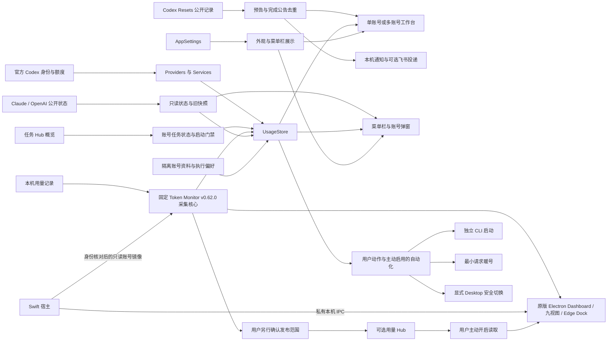

# AiGoodBro 2.0 · macOS 架构

当前 macOS 候选为 **AiGoodBro 2.0 · 9.6.13 (62) · 0927v1**。本文描述本机工作台结构；已验证能力与安装状态以 [2.0 记录](docs/ai-goodbro-2.0-0927v1.md)为准，使用方式见 [README](README.md)，安全约束见 [SECURITY](SECURITY.md)。

## 主要关系

## 代码分层

| 目录 | 职责 |
| --- | --- |
| `App/` | 生命周期、窗口、菜单栏与全局快捷键 |
| `Domain/` | 额度窗口、执行偏好、占用策略、身份与展示模型、自测 |
| `Providers/` | Runtime 适配与数据来源选择 |
| `Services/` | 读取、持久化、官方接口、Hub 状态与安全事务 |
| `UI/` | 原生 SwiftUI/AppKit 展示与用户交互 |
| `Resources/` | 图标、配色契约、本地化与第三方许可证 |
| `scripts/` | 构建、测试、资源与发布检查 |
| `Companion/TokenMonitorDesktop/` | 上游完整桌面模块的 staging 品牌、生命周期、账号与更新适配 |

Swift 生产代码位于 `Sources/CodexUsageWidget/`；`Resources/`、`scripts/` 与 `Companion/` 位于仓库根目录。历史目录名、配色 ID 和 Windows 包名属于内部兼容标识，不代表当前产品品牌，也不能为改名而破坏已有设置。

## 账号与任务

单账号和多账号共用身份与额度模型。同一身份的系统入口与隔离入口去重，单账号只收起无意义的批量控件。

每个独立账号保存模型、思考强度与速度。后续 CLI 启动命令携带主任务与默认子 Agent 参数，不改写系统 Codex 配置；已运行任务不被中途修改。

任务 Hub 是外部服务。AiGoodBro 读取任务状态，不创建 Hub 任务。只有可信账号映射、新鲜概览与可用状态均成立时，任务入口才开放。这里仍存在检查到启动的竞态，不是跨进程原子租约。用量 Hub 是独立的可选连接；读取和发布本机用量分别开启，发布还需确认范围，均不参与任务占用判定。

## 用量、状态与重置消息

完整 Token Monitor v0.62.0 Electron 主进程、preload、renderer、Edge Dock、依赖和扫描器随包固定，并验证源文件与 ASAR 哈希。用量界面直接使用原版布局、CSS 和提供商图标；Swift 宿主经私有连接管理启动、退出、导航与账号事务。菜单栏提供 Home / Tool / Status / Device / Model / Project / Session / Limits / Trends。已有原生工作台和自定义统计路径保留。WidgetKit 与 Antigravity OAuth 的能力限制按当前集成记录单独记账。

公开重置预告与已完成公告使用独立投递记录。首次有效观察建立基线，新公开预告在已启用推送且飞书机器人已配置时自动提醒；结果不明时不会自动重发。预告不表示账号额度已到账，额度仍需刷新官方账号数据。

## 暖号与切换是不同事务

暖号默认关闭。启用后先读取身份与额度，检查 Hub 空闲状态，再发送最小请求并读取最新额度。会消耗额度，不会兑换重置券，不会切换 Desktop。

Desktop 切换必须显式触发，沿用身份验证、锁、优雅退出、原子写入、写后验证、回滚与恢复流程。独立 CLI 不走 Desktop 切号路径。

## 设置与证据

原生设置保留显示、自动化、工作区和关于；菜单栏、浮窗和用量设置转入原版用量设置。上游外观设置保存在独立数据目录；宿主账号由 AiGoodBro 维护，向用量模块只提供经过身份核验的内存镜像。首次语言跟随宿主，用户之后的选择会保留。

0905v3 的 24 张隔离演示图片已退出公开展示，见[界面资料清理记录](docs/public-ui-1008v1.md)；2.0 的集成和实机证据见[本轮验证记录](docs/ai-goodbro-2.0-0927v1.md)。截图不证明真实登录、暖号、任务派发或通知发送成功。纯测试、真实运行与公开安装包分别记录，不能相互替代。

Windows 工作区仍保留，不宣称与 macOS 的账号管理能力等价。见 [Windows 范围](windows/README.md)。
