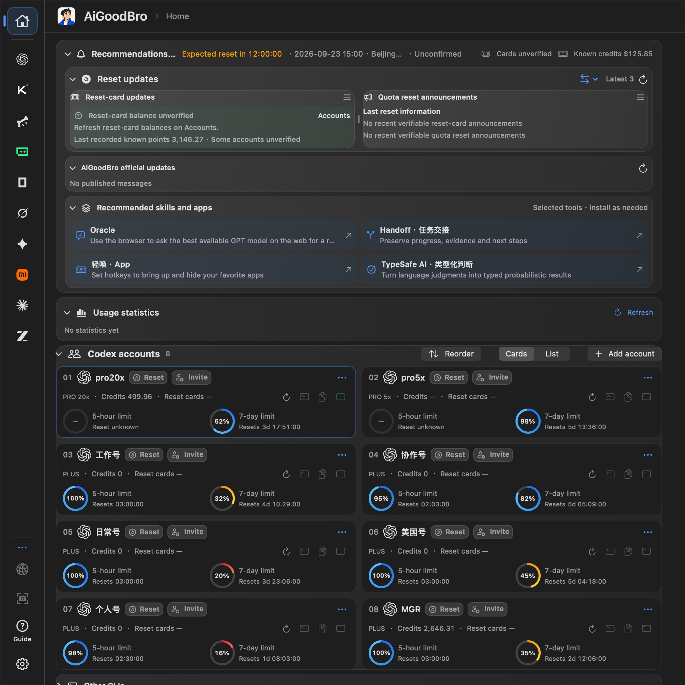
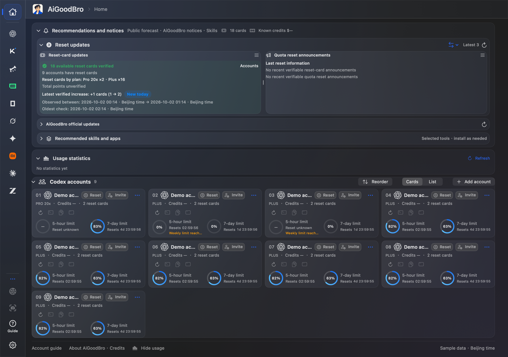
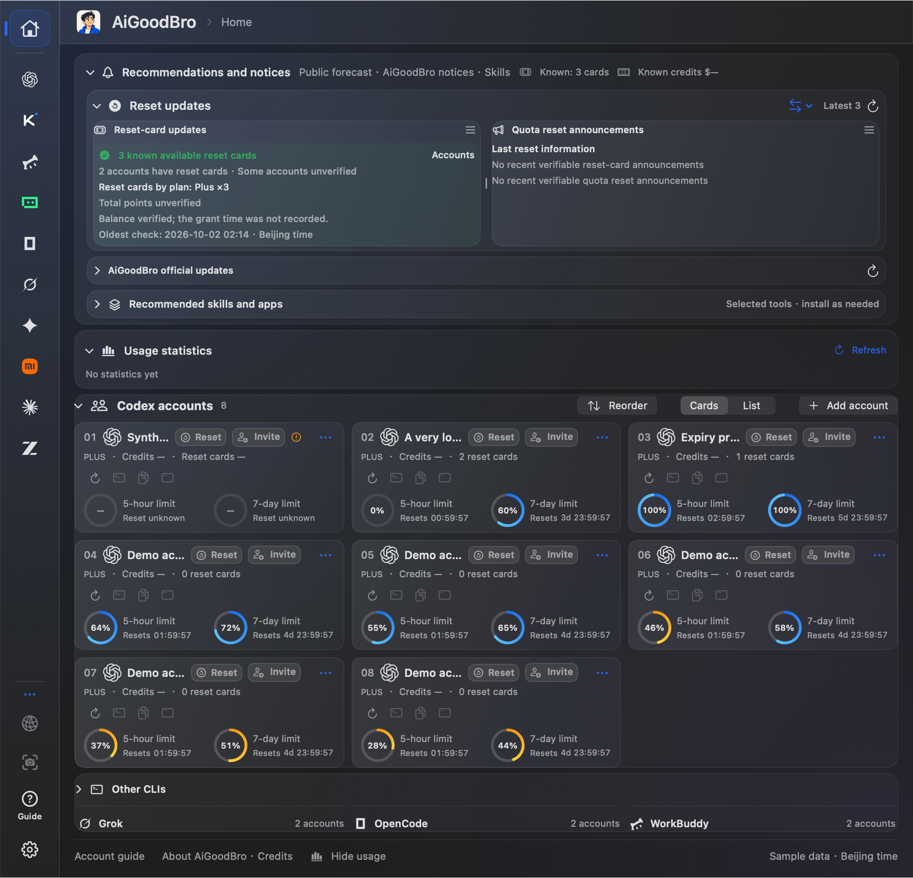
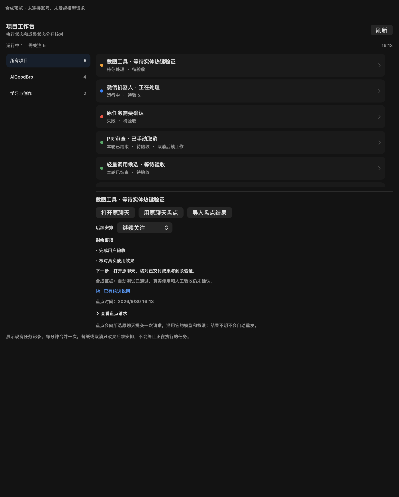
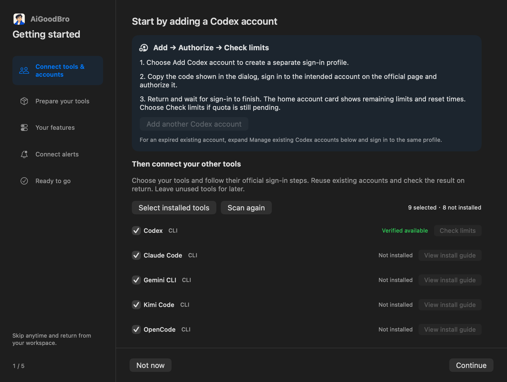
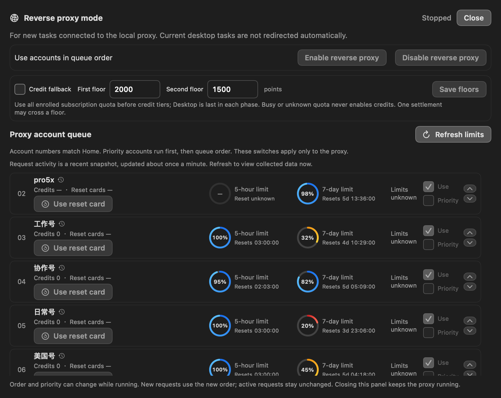
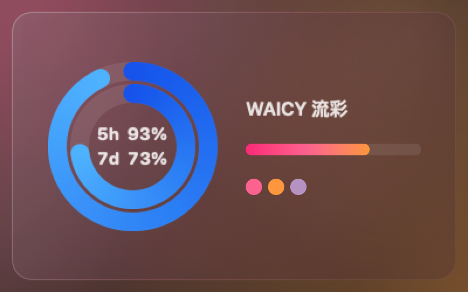

# AiGoodBro · AgentHub (2.2 candidate)

**See quota, usage and task occupancy at a glance; when needed, route local work through your own Codex account pool.**

AiGoodBro is a macOS AI workspace for personal use. It brings together quotas for multiple Codex accounts, token usage, local CLIs and public reset announcements, with an optional local proxy. The interface supports Chinese and English; its home page is called AgentHub.

[中文](README.md) | **English**

The latest source candidate is **2.2 · 1005v3**, with internal update version 9.6.75 (125). It retains optional reset-card redemption, one-line expiry dates, compact proxy rules and ring/fish displays, fixes a failed profile blocking another valid profile for the same account, and shows ∞ for verified weekly-only Pro quota. Build 124 is installed locally; 125 is not installed and has no official installer. See the [usage guide](docs/usage-guide.md) and [changelog](CHANGELOG.md).

The next feature version will reopen WeChat and Feishu connection onboarding after each installation; see the [reinstallation plan](docs/reinstall-onboarding-plan-1005v1.md).

**Help avoid forgotten reset cards expiring unused.** Opt in for each account to let the app attempt redemption near expiry, by default 30 minutes beforehand with an adjustable lead time. This is off by default and requires the app to remain running. Only verified, idle independent managed accounts are eligible; the current desktop identity is excluded. Uncertain outcomes pause for review instead of being retried automatically. See the [reset-card behavior and limits](docs/reset-credit-control.md).

The images below retain their 1002v2 provenance. The [full gallery](docs/images/1002v2/README.md) covers home, accounts, proxy, settings, setup, usage panels and all nine themes. Historical real captures retain their version labels.

## See what is happening

Home shows each account's remaining quota, reset time and task occupancy. Public reset announcements stay distinct from an account's actual quota. Usage views summarize token, model and tool activity; estimated costs are based on local data, not provider bills.



*Home supports resizable sections, cards and rows. The two reset panels share the available width and preserve the user’s chosen proportions.*

Codex's isolated CLI can use its own local sign-in directory; support for other tools depends on the provider. Account cards and rows let you refresh quota, change order, choose a model or start an isolated CLI. See the [CLI quota coverage](docs/local-cli-accounts.md) for supported providers and limits.



*Codex account cards.*

The workspace shows quota and status for connected tools; availability depends on the tool and current sign-in. ZCode is a desktop tool, not a CLI. WorkBuddy desktop quota is currently unreadable. The Kimi CLI view shows its previous snapshot; refresh it before relying on the value.



*Tool status, quotas and controls follow each provider’s capabilities; unreadable quotas retain an explicit notice.*



*The project workbench distinguishes execution from accepted outcomes and keeps remaining work and the original chat available. This preview is in Chinese.*

## Setup guide: connect official tools and accounts

Follow the guide to sign in to an official tool or account, then return to the workspace to check its connection status. Connect each tool when you need it.



## Local proxy: route requests through your own account pool

The optional local proxy is a personal tool. Compatible clients send model requests to a service on this Mac; AiGoodBro selects an enrolled account by participation, priority and saved order. Available subscription quota across participating accounts is used before credits, and the current Desktop account is tried last in each quota phase.

Credit continuation is off by default. Only if the user enables it does the proxy enter credit phases after subscription quota is exhausted. Busy or unknown accounts do not count as exhausted. The credit threshold guides account selection between requests; it is not a per-request hard cap.

The proxy routes inference requests only. Codex Desktop keeps its OpenAI sign-in, each conversation's model and reasoning effort; using the proxy does not change system authentication files or global configuration. An already-running Codex process does not switch routes until it is restarted and connected again.



*The synthetic preview shows account order, quotas and credit floors. The standalone window now uses one rounded glass surface with a transparent titlebar and no dark separator. The AppKit frame still needs a real-window check after a normal restart.*

**Start and stop it yourself:**

1. Turn on the proxy manually in AiGoodBro. It does not start automatically when the app restarts.
2. Quit Codex. The **Connect Desktop** button appears only after the proxy starts successfully and its connection details are ready; choose it to relaunch Codex with the local route.
3. When finished, stop the service in the proxy panel. Closing the main window only hides it; quitting the app asks whether to stop the proxy. Reopen Codex normally after stopping it.

Once a streamed response has begun, an error is not replayed through another account. An uncertain result is not sent again automatically, avoiding duplicate task execution. Proxy controls and the Connect Desktop entry are present in the candidate UI; their presence does not prove end-to-end acceptance.

The proxy is designed for personal use with your own accounts and local tasks. This project does not provide accounts, credential sharing, quota resale or a public proxy service.

Personal WeChat uses the official Tencent iLink QR connection for reset notifications, cached status commands and explicitly enabled conversation in a chosen original Codex chat. The project workbench separates execution and outcome, preserving manual pause, cancellation, acceptance and remaining work. Normal display does not call a model; phone delivery and real conversation remain unaccepted. See the [WeChat and workbench guide (Chinese)](docs/wechat-workbench-0930v1.md).

## Nine themes and native glass

Choose a palette in Settings → Appearance. Each theme supports light and dark modes. Default keeps the neutral interface; other palettes share the native glass renderer with adjustable transparency and depth. macOS Reduce Transparency and Increase Contrast take precedence.

| Theme | Visual character |
|---|---|
| Default | Neutral gray with blue-violet accents; remains the default. |
| Liquid Keycap | Cool blue and cyan with light glass layers. |
| Blue & White Porcelain | Porcelain white and cobalt blue. |
| Monterey Dawn | Orchid purple, pink and warm dawn tones. |
| A Thousand Li of Rivers | Mineral green and blue. |
| Dunhuang Apsara | Sand gold, ochre and turquoise. |
| Forbidden City Red | Red walls, gold and deep contrasting surfaces. |
| Violet Glow | An independent glass variant of the existing default blue-violet tokens. |
| WAICY Sunset | A three-stop pink-to-orange gradient based on badge-candidate colors. |



[View light and dark previews of all nine themes](docs/images/1002v2/README.md#themes). Themes supply color tokens only. WAICY artwork, logos, mascots and fonts are not copied, and the palette does not imply official endorsement.

## Current candidate and historical installation

Build 125 is a source candidate; build 124 was delivered as a local installer. This run updates GitHub source without publishing installer assets. Isolated automatic-redemption tests and native previews do not validate real redemption, WeChat phone delivery or installed pointer and global-shortcut interaction.

The verified installed version is **9.6.74 (124)**. Build 114 installation checks, synthetic native previews and app self-tests belong to the historical 1003v1 record. See the [114 publication record](docs/source-publication-1003v1.md) and [historical PR #13 checks](https://github.com/BLACKIELF/AgentHub-AiGoodBro/pull/13/checks); these are not CI evidence for 125.

The following historical 1003v1 source example does not retrieve the current 125 source candidate:

```sh
git clone --branch codex/reset-messages-0926v1 https://github.com/BLACKIELF/AgentHub-AiGoodBro.git AiGoodBro-2.2
cd AiGoodBro-2.2
make build
```

Source builds require macOS, Go 1.26+ and the verified Token Monitor v0.62.0 macOS runtime; see the [build and publication record](docs/source-publication-1003v1.md). No official 2.2 installer is currently available. Further Windows work remains on hold.

## Inspiration, code sources and licenses

Feature design borrows from related open-source projects. Code and resources directly reused or adapted are listed below, with their applicable licenses and copyright notices retained.

| Project | Relationship |
|---|---|
| [Tencent/openclaw-weixin 2.4.9](https://github.com/Tencent/openclaw-weixin/tree/24de5c9eb0dd5e595d7e2d090ed8a3f82870d42c) | Native adaptation of iLink protocol and QR pairing; MIT notice retained, without installing OpenClaw. |
| [codexU](https://github.com/shanggqm/codexU) | Second-developed host integration from the historical fixed source: SwiftUI, quota, palette and Windows foundations were inherited and are maintained by AiGoodBro. |
| [Token Monitor v0.62.0](https://github.com/Javis603/token-monitor/tree/dcccfb01557e2786888fd5479552f392ac6c0d32) | Second-developed native integration from the fixed upstream source: the statistics engine, dashboard, charts and resources remain bundled with the AiGoodBro bridge and Swift host. The local zero-quota fix and review of later releases are in the [current publication record](docs/source-publication-1003v1.md). |
| [Tokscale fork](https://github.com/Javis603/tokscale) · [original](https://github.com/junhoyeo/tokscale) | Second-developed native integration from the pinned revision; the collection foundation and license remain bundled as revision `06a9f1625d5a505f01b39eff29f7be44a2c52188`. |
| [CLIProxyAPI v8.0.2](https://github.com/router-for-me/CLIProxyAPI/tree/v8.0.2) | Host adapter over fixed upstream code: the SDK scheduler, Codex executor and Responses handler are reused, with a narrow adaptation of v8.0.7's pre-first-frame disconnect 502/failover behavior. The dependency was not upgraded wholesale. |
| [Codex-Manager](https://github.com/qxcnm/Codex-Manager) | Protocol adaptation and static research reference; the warm-up request structure and SSE completion rules are independently implemented in [`CodexAccountActions.swift`](Sources/CodexUsageWidget/Services/CodexAccountActions.swift#L850). |
| [Hazmat wrapper script](https://github.com/dredozubov/hazmat/blob/c112d222bb53e888dd17a8927927286792f7c20e/scripts/check-codex-desktop-attach-smoke.sh) | Protocol adaptation and static research reference for the `CODEX_CLI_PATH` stdio-wrapper entry point; no Hazmat sandbox or service is integrated. |
| [BlackHole1/aswap v1.1.0](https://github.com/BlackHole1/aswap/releases/tag/v1.1.0) | The Claude multi-account CLI/Chrome profile tool from the referenced X post; protocol adaptation and static research reference only, with no copied, bundled or Codex, Feishu or WeCom integration. |

AiGoodBro is licensed under [MIT](LICENSE). Full third-party license texts and copyright notices are in [`Resources/THIRD_PARTY_NOTICES.txt`](Resources/THIRD_PARTY_NOTICES.txt), [`Companion/LocalProxy/LICENSE.CLIProxyAPI`](Companion/LocalProxy/LICENSE.CLIProxyAPI), [`Companion/LocalProxy/LICENSE.Hazmat`](Companion/LocalProxy/LICENSE.Hazmat) and [`Companion/LocalProxy/THIRD-PARTY-NOTICES.txt`](Companion/LocalProxy/THIRD-PARTY-NOTICES.txt).

## More information

[Detailed guide (Chinese)](docs/usage-guide.md) · [CLI quota coverage](docs/local-cli-accounts.md) · [Proxy implementation and validation](docs/local-proxy-0928v1.md) · [Current source publication record](docs/source-publication-1003v1.md) · [Historical real captures: 0929v2](docs/images/0929v2/README.md) · [Historical screenshots: 0927v6](docs/images/0927v6/README.md) · [Historical screenshots: 0910v1](docs/images/0910v1/README.md) · [Report an issue](https://github.com/BLACKIELF/AgentHub-AiGoodBro/issues) · [Security](SECURITY.md)

[MIT license](LICENSE) · [Third-party notices](Resources/THIRD_PARTY_NOTICES.txt) · [Brand compatibility](docs/brand-compat-0911v1.md)
