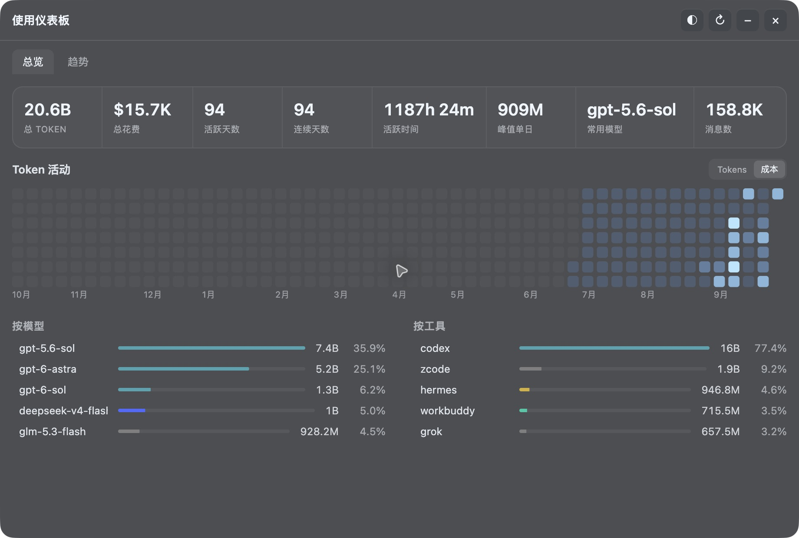
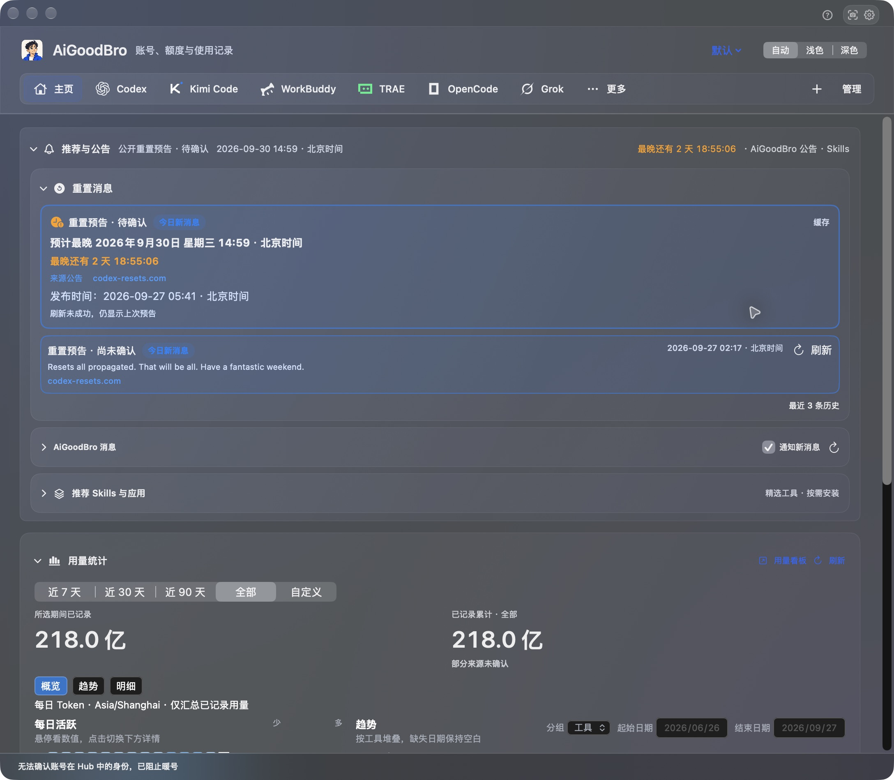

# AiGoodBro · AgentHub（2.0候选）

AiGoodBro 是面向个人自用的 macOS AI 工作台。它把 Codex 多账号额度、Token 用量、本机 CLI、公开重置消息和可选的本地反代放在一起，方便查看剩余额度、重置时间与任务占用，并在需要时启动独立 CLI。界面支持中文和英文，主页名为 AgentHub。

**中文** | [English](README.en.md)



> 2026-09-27 实机截图，来自 AiGoodBro 2.0 / 9.6.17 (66)，展示 Token 活动、模型与工具排行；它不是 9.6.32 (82) 的当前界面。金额为用量估算，不是实际账单。[图片说明](docs/images/0927v6/README.md) · [当前候选验证记录](docs/source-publication-0929v1.md)。

每天开工前，先回答四个问题：还剩多少额度、几点恢复、这个账号现在能不能用、任务进行到哪一步。

AiGoodBro 把额度提醒与消息放在前面，让你及时知道什么时候可以继续工作，再决定使用哪个账号。

| 你要做的事 | AiGoodBro 提供的功能 |
|---|---|
| 看还剩多少额度 | 读取官方返回的 5 小时、7 天等额度窗口，显示剩余比例、重置时间和数据更新时间；低额度阈值可调整，未知数据显示“—” |
| 看多 Agent 用量 | 接入固定版本的 [Token Monitor v0.62.0](https://github.com/Javis603/token-monitor) 完整桌面模块，在原版 Dashboard 查看指标、热图、趋势及模型和工具排行；图标、尺寸、字体和玻璃使用原代码 |
| 随时看今日用量与额度 | 开启右侧停靠栏后，在屏幕边缘查看今日 Token、估算费用与平台额度环；悬停看详情，可自动隐藏、固定或拖动换边，速率有真实计时样本时显示 |
| 及时知道重置消息 | 跟踪 [Codex Resets](https://codex-resets.com/) 已公开的预告和完成公告，保留发布时间与原文入口；开启推送并配置飞书后，新预告自动发送提醒，账号额度仍需单独刷新 |
| 看服务状态 | 在菜单栏 Status 查看 Claude 和 OpenAI 的公开服务状态；读取失败时标明旧快照 |
| 把提醒送到常用渠道 | macOS 本机通知、可选飞书提醒，以及可配置的 Telegram / 企业微信群机器人；各渠道需要相应权限和配置，具体事件范围见下文 |
| 一键切换账号 | 从账号卡发起 Desktop 切换，展示准备、退出、写入、重新打开和验证进度；隔离 CLI 可独立使用其他账号 |
| 低额度接续（验证中） | 已提供 1% 暂停、切号与原任务续做入口；当前 Desktop 的完整实机链路仍在接入与验证，不能确认任务状态时不切换，未知提交结果不重复发送 |
| 多账号协作与排障 | 分别保存 CLI 环境和模型偏好，准备调用即登记占用，记录任务阶段、调用回执及运行问题，便于定位失败原因 |

单账号也能只读使用。公开重置公告、某个账号的额度恢复、账号持有的重置卡是三种不同信息：收到公告不会自动使用重置卡，也不能替代账号额度刷新。软件内的微信接入指**企业微信群机器人**；个人微信未接入。

**当前源码候选：AiGoodBro · AgentHub（2.0候选），0929v2 / 9.6.32 (82)。** 左侧页面导航与底部设置菜单，紧凑账号卡片 / 列表，保留统一编号、短细额度条、精确重置时间、点数和调度开关。首页沿用 Token Monitor 的日历、柱状图及 K 线交互，模型 / 工具明细默认折叠。ZCode Start Plan 显示完整 Token 额度；Kimi / Grok 自动续期读取额度，TRAE 国内个人版显示积分，WorkBuddy 桌面额度仍不可读取。反代运行中可调整优先级与顺序；全部参与账号的订阅额度先于点数，桌面账号在每个阶段最后使用。原生生图 / 图片编辑保留模型、提示词和参考图，结果不明时不自动重发。CC Switch 已配置的余额仅用于 Claude CLI。本次上传复检 33 项纯自测中 31 项通过，2 项失败详见[当前候选发布检查](docs/source-publication-0929v1.md)；82 仍为候选。历史构建、签名、CLI 额度与反代回归及官方 app-server 隔离验证见[集成记录](docs/local-proxy-0928v1.md)。候选位于 `codex/reset-messages-0926v1` 分支及 [PR #13](https://github.com/BLACKIELF/AgentHub-AiGoodBro/pull/13)；`main` 保留现有主线且不包含 82。2.0 尚无 GitHub 下载包。

**本地反代与桌面接入。** 反代单独开启，支持参与调用、优先调用和账号队列排序，按请求占用账号，额度不足后尝试后续可用账号。退出 Codex 后，从反代面板点击“接入桌面”；每个对话保留自己的模型和推理强度。桌面保留 OpenAI 登录身份，只有模型请求经本机代理转入账号池，不改系统认证或全局配置。关闭代理后需要正常重开 Codex；旧任务在新版适配器中恢复一次后可继续。真实 app-server 的隔离测试已覆盖旧任务恢复、工作区身份、关闭反代后续做及历史读取；40 MiB 图片请求、40 MiB 压缩上下文请求与 65 MiB 桌面消息通过。75 的适配器在原进程中执行官方签名的 Codex，转发工作交给旁路子进程；原生签名校验模块已通过隔离验证，未放宽校验规则。build80 的真实 Desktop→账号池请求是历史验证；82 版反代由用户手动开启与接入，本次发布检查未验证当前 Desktop 路由。WAICY 大消息恢复、自动暂停→切号→续做、最终界面回归及真实反代生图仍待验收。[反代集成记录](docs/local-proxy-0928v1.md) · [当前候选发布检查](docs/source-publication-0929v1.md) · [0927v6 历史验收记录](docs/source-snapshot-0927v6.md)。

### 个人自用与技术背景

本地反代为个人自用场景设计，用于自己的账号和本机任务；本项目不提供账号、凭据共享、额度转售或公共代理服务。依赖组件仍按各自许可证说明。

Tibo（@thsottiaux）在介绍 GPT 与 Claude Code 配合使用的 2026-07-12 公开帖中提到 CLIProxyAPI；[查看原帖](https://x.com/thsottiaux/status/2076119366647894371)。该引用仅说明技术背景，不代表官方对本项目的授权或背书。

## 功能来源与许可证

功能设计参考、借鉴了相关开源项目；实际直接复用的代码与资源单独列明，并保留原许可证和版权声明。

| 来源 | 关系 |
|---|---|
| [codexU](https://github.com/shanggqm/codexU) | 历史 SwiftUI、额度、配色与 Windows 基础直接继承。 |
| [Token Monitor v0.62.0 固定提交](https://github.com/Javis603/token-monitor/tree/dcccfb01557e2786888fd5479552f392ac6c0d32) | 统计引擎、桌面看板、图表与资源直接复用，并适配宿主应用。 |
| [Tokscale fork](https://github.com/Javis603/tokscale) · [original](https://github.com/junhoyeo/tokscale) | 统计采集基础；打包修订为 `06a9f1625d5a505f01b39eff29f7be44a2c52188`，见 [`SOURCE.json`](Companion/TokenMonitorEngine/SOURCE.json)。 |
| [CLIProxyAPI v8.0.2 固定版本](https://github.com/router-for-me/CLIProxyAPI/tree/v8.0.2) | SDK 调度、Codex 执行器与 Responses 处理器直接复用。 |
| [Codex-Manager](https://github.com/qxcnm/Codex-Manager) | 暖号请求结构与 SSE 完成规则的实现适配，见 [`CodexAccountActions.swift`](Sources/CodexUsageWidget/Services/CodexAccountActions.swift#L850)。 |
| [Hazmat stdio wrapper 脚本](https://github.com/dredozubov/hazmat/blob/c112d222bb53e888dd17a8927927286792f7c20e/scripts/check-codex-desktop-attach-smoke.sh) | 参考 `CODEX_CLI_PATH` 的 stdio wrapper 入口；未集成 Hazmat 沙箱或服务。 |

许可证和完整版权声明见 [`LICENSE`](LICENSE)、[`Resources/THIRD_PARTY_NOTICES.txt`](Resources/THIRD_PARTY_NOTICES.txt)、[`Companion/LocalProxy/LICENSE.CLIProxyAPI`](Companion/LocalProxy/LICENSE.CLIProxyAPI)、[`LICENSE.Hazmat`](Companion/LocalProxy/LICENSE.Hazmat) 与 [`THIRD-PARTY-NOTICES.txt`](Companion/LocalProxy/THIRD-PARTY-NOTICES.txt)。详细来源、固定版本和本轮验证边界见[候选发布检查记录](docs/source-publication-0929v1.md)。

下面提供安装口令和 4 个调用模板。2.0 候选源码位于 `codex/reset-messages-0926v1` 分支及 [PR #13](https://github.com/BLACKIELF/AgentHub-AiGoodBro/pull/13)；`main` 保留现有主线且不包含此候选。当前没有可下载的 2.0 安装包。

[](https://github.com/BLACKIELF/AgentHub-AiGoodBro/actions/workflows/ci.yml)

[](LICENSE)

## 先装好，少做几次重复操作

把下面整段发给有本机执行能力的 Agent：

```text
请从 https://github.com/BLACKIELF/AgentHub-AiGoodBro 安装或升级 AiGoodBro。先读 README，检查系统、依赖和现有安装；记录当前设置，等待应用自己的操作结束，把旧版备份到专用回滚目录，再迁移为唯一的 AiGoodBro.app。保留账号、调度参与状态、模型偏好和当前 Codex 登录，安装后逐项核对应用名称、实际运行版本与设置。不要留下两份可启动 App，不要终止其他 CLI 任务，也不要为验证而启动真实任务、切号或发送通知。需要官方登录时由我手动完成。
```

需要 macOS 13+、已正常登录的 Codex，以及 Xcode Command Line Tools。只有一个账号也能先用只读监控。CLI 与暖号还需要配置本机 Hub 和账号映射；没有配置时，相关入口保持关闭并提示原因。首次引导会检查现有 Python 3.9+ 和 Codex CLI，按需准备配套 Skill；依赖由用户安装，AiGoodBro 不内置外部 Python 或 Codex。配套 Hub 在确认项目和账号后单独设置，已存在的服务会保留。

构建 2.0 候选（9.6.32 / 82）：

```sh
git clone --branch codex/reset-messages-0926v1 https://github.com/BLACKIELF/AgentHub-AiGoodBro.git AiGoodBro-2.0
cd AiGoodBro-2.0
make build
```

需要现有主线版本时，仍可从 `main` 构建；该分支不含 82 候选：

```sh
git clone --branch main https://github.com/BLACKIELF/AgentHub-AiGoodBro.git AiGoodBro-main
cd AiGoodBro-main
make build
```

源码构建还需要 Go 1.26+，用于编译固定 CLIProxyAPI v8.0.2 的本地反代组件；安装后的代理无需另外安装 Go。完整桌面模块的构建需另提供已校验的 Token Monitor v0.62.0 macOS arm64 官方运行时，默认读取 `/Applications/Token Monitor.app`；当前限制见[候选发布检查记录](docs/source-publication-0929v1.md)和[反代集成记录](docs/local-proxy-0928v1.md)。较早的 0927v5 集成过程保留在[历史记录](docs/ai-goodbro-2.0-0927v5.md)。

构建结果应为 `build/AiGoodBro.app`。构建不会自动安装或启动；升级时先备份旧版，再迁移为唯一的 `AiGoodBro.app`，不要留下两个可启动副本。详见[安装与配置](docs/usage-guide.md#安装与配置)与[品牌兼容表](docs/brand-compat-0911v1.md)。本机构建使用 ad-hoc 签名；2.0 候选没有已发布的 Apple 公证下载包。

后续若发布，安装包名称应为 `AiGoodBro-<version>-mac-<arch>.dmg`；当前没有可下载的 2.0 安装包。

## 打开后，先看这张工作台



*历史实机截图来自 9.6.17 (66)，不是 9.6.32 (82) 的当前 UI；账号卡已折叠，缓存与未确认状态按原样展示。当前候选边界见[发布检查记录](docs/source-publication-0929v1.md)。*

主页依次呈现 Agent 导航、公开重置消息、Token 汇总与账号。公开预告和已完成公告分开显示，并保留发布时间、中文说明与来源入口；预告不代表账号额度到账。用量界面提供 Home、Tool、Status、Device、Model、Project、Session、Limits、Trends，服务状态读取公开摘要。

2.0 集成候选采用固定的 Token Monitor v0.62.0 完整桌面代码，包含原版看板、菜单栏和右侧浮窗，通过 AiGoodBro 统一启动和退出。美元费用是根据本机用量估算的成本，不是供应商账单。实际读到的工具、模型、会话与项目维度按数据展示；未能确认的历史账号归属保持未知。设置 → 工作区 → 统计方式可以切回原有自定义模式，两套结果分别计算。

统计运行时和固定依赖随 App 打包，不需要另外安装 Node.js。首次源码构建需要准备经过校验的依赖缓存；当前集成与验证边界见[候选发布检查记录](docs/source-publication-0929v1.md)和[反代集成记录](docs/local-proxy-0928v1.md)。早期 0927v5 集成记录仍保留作历史参考。Hub 读取跨设备数据与发布本机用量分别选择，默认均关闭；发布前还要确认数据范围。

设置 → 右侧边栏提供独立的屏幕边缘入口，默认依次显示今天、最多三个已有额度平台和 `tok/s`。悬停展开详情卡，点击固定栏体；可选择自动隐藏或始终显示，并拖动顶部调整位置。设置中可增加“总计”等项目，详情卡支持工具／模型排行与精确 Token 数。速率取自新采集性能记录的实际输出量与耗时，有样本才显示；采集间隔内可能显示上次样本或“—”。

主页使用统一布局，品牌与 Agent 导航固定在顶部。点“管理”可拖动调整导航，保存或取消；右上角问号打开使用引导。设置使用独立原生窗口，按显示与图标、菜单栏、悬浮窗、自动化、工作区、用量统计和关于分类。默认主题使用原生毛玻璃效果，支持中文、英文及系统“降低透明度”。总览按账号显示真实状态，未读到的额度保留“—”。


卡片并排显示 5 小时和 7 天额度；列数随窗口宽度调整，窄窗减少列数以保留可读宽度。常用按钮集中在底部，详细暖号记录放在“详情”。官方重置时间仍在额度下方。官方未返回的窗口显示“—”，界面以实际返回的数据为准。切换成列表可以连续查看更多账号；卡片适合横向比较，账号顺序与操作保持一致。

首页按账号统一排列各平台，通过账号的更多菜单置顶常用账号；“管理账号”中可调整 Codex 顺序，需要重新登录的账号集中在右侧菜单。有重置卡在未来 72 小时内到期且官方证据仍新鲜的账号优先提示。Grok 官方未返回卡数量与到期信息时明确显示未知。

每个账号都能单独刷新、设模型、打开独立 CLI。执行偏好会传给后续任务，已有任务继续使用启动时的参数。新账号默认 **GPT-6 Astra / Low / 标准速度**；模型是否可用仍由目标账号和服务端决定。

> 以下界面图保留自 0910v1，由当时的生产 SwiftUI 组件原生渲染，使用演示账号、额度和日期，不读取个人凭据。图中的“状态待确认”表示未连接 Hub。[图片来源与制作提示词](docs/images/0910v1/README.md)

> 图片可能展示早期布局，仅用于介绍界面；2.0 当前候选的来源与实机验收边界见[发布检查记录](docs/source-publication-0929v1.md)。

## 选择 CLI、执行档位和消息内容

工作台顶部可选择本机已安装的 Codex、Grok、Kimi Code、Claude Code、OpenCode、Gemini CLI、MiMo 和 ZCode。每个 CLI 可关联已有登录目录，分别命名和刷新；支持范围见[账号与额度说明](docs/local-cli-accounts.md)。ZCode 可读取当前账号的个人 Coding Plan 与 Start Plan，完整显示模型 Token 剩余 / 总量；TRAE 国内个人版可读取当前登录的积分。MiMo 原生额度与 WorkBuddy 不可读的官方会话仍明确提示，工具已安装不等于额度已连接。

模型菜单提供三个可改名称和组合的档位：沿用当前模型、Sol High 配 Luna Max 子代理、Luna Max 直接执行。每档均可更改主模型、强度和子代理配置；启动前校验最终参数。配置显示与实际执行证据分别记录。

飞书设置可选择账号备注、额度、重置时间、重置卡数量及最近或全部到期时间；Agent 名称和官方余额可选。默认省去长编号。主界面余额四舍五入为整数，发生取整时显示“≈”；点击说明可看精确原值、来源与时间。接口未提供币种和换算时不标为美元。

自动化中心新增 [Telegram 与企业微信](docs/message-channels-0911v1.md)，分别开启和配置；默认关闭，保存后可发送测试。Codex 任务完成提醒要求实时观察到同一任务从运行到完成，归档和历史快照不会触发。凭据存入 AiGoodBro 独立 Keychain；本版离线回归没有发送真实消息。

选中账号后可看到“使用重置卡”。此入口仅供用户手动操作，Agent 不得主动使用。它要求三次明确确认，发送前重新核对账号、卡片、期限和占用。**本次没有执行或测试重置流程**；未确认结果会保留原尝试，禁止自动重试。详见[实现和验证边界](docs/reset-credit-control.md)。

## 不用守着倒计时等暖号

5 小时与 7 天暖号分别设置。AiGoodBro 到时先刷新官方额度，再核实账号身份和占用，条件满足才发送一次最小请求，尝试开启下一轮窗口。

需要 AiGoodBro 持续运行、电脑唤醒并联网。暖号会消耗少量额度；账号忙碌、任一已知订阅窗口用尽或状态不明时会等待复核。有额外余额也不会因此继续暖号。到重置时间先只读刷新，确认额度恢复后再继续；普通失败按间隔重试。成功后即使额度仍显示 100%，也不会因此每分钟重复暖号。

“参与调度”只决定能否接新任务。关闭后仍能刷新额度、检查会员日期，并按全局开关维护窗口。暖号不增加额度，也不使用重置券。

## 准备调用时，就让其他任务知道

通过配套调度协议调用时，先预约账号和工作目录，再做环境检查和启动。其他遵守协议的调用可以立即读到占用，AiGoodBro 界面约每 10 秒更新。

| 你看到的状态 | 含义 |
|---|---|
| 在线·准备中 | 已占位，尚未证明真实执行 |
| 在线·运行中 | 有真实进程或 Hub 运行证据 |
| 在线·维护中 | 暖号或经过授权的维护占位 |
| 已结束·待验收 | 进程已结束，成果还要检查 |
| 状态待确认 | 信息不足，继续保留占用 |

同账号或同一真实项目目录的并发预约会被拒绝。心跳超时不会直接当成空闲。问题按日期追加到同一个日志，后续修复与验证接着记录；工作台有“运行问题日志”入口。

AiGoodBro 的终端按钮会登记占用并等待启动回执；退出码 0 只表示会话结束。配套新版 Hub 在创建和批准时检查共享占用；旧 CLI 和旧 Hub 仍需检查实际进程。AiGoodBro 不会接管旧入口。[协议、接入条件与日志](docs/dispatch-coordination.md)

## 重置消息来了，先收到提醒再核对账号

“接收重置消息”默认开启。AiGoodBro 运行时每 5 分钟查询 [Codex Resets](https://codex-resets.com/) 的公开记录，不消耗账号额度，也不用选择账号或配置飞书。首次检查记住已有记录，不补发历史消息；后续新消息使用 macOS 通知，需在系统中允许 AiGoodBro 通知。开启飞书转发并完成机器人配置后，新公开预告也会自动发送到飞书，方便及时安排任务、减少反复刷网页。

工作台底部“自动化中心”的第一项就是“重置消息”，可以看最新内容、刷新或关闭。没有通知权限时，消息仍可在这里查看。需要转发到飞书，再展开“同时发送到飞书（可选）”。升级保留已有关闭选择。

飞书消息使用调度编号与账号备注。连接测试、手动切换、测试重启和低额度事件分别标明原因；低额度提醒只列实际达到的条件。

飞书可在“使用引导”直接保存并连接。已有机器人需要权限时点击“授权连接”，只在 macOS 系统弹窗中输入登录密码；可选择“始终允许”记住授权。后台检查不弹密码框。本地 ad-hoc 构建更换后可能需要重新授权一次。


这是第三方汇总的公开消息，不能证明你的账号已经重置，也不会自动使用重置卡。账号可用额度和重置卡数量仍以官方刷新结果为准。

“参与调度”旁的时钟可设置允许派单的时段、星期和时区，也支持跨午夜。时段只限制新任务，刷新和暖号继续按自己的开关执行。配套 Skill 会检查时段；Hub API 的同等保护需要部署匹配的 Hub 版本。

## 切换时，知道正在做什么

点击“切换 Desktop”后立即显示准备状态；等待已有刷新结束时可以取消。身份和额度检查在后台并行完成，之后显示退出、切换、打开和验证进度。来源与目标账号同时保留维护占用，避免另一项任务抢先使用。

真正换号仍需安全退出并重新打开 Codex，耗时取决于网络及进程状态。普通切换不会超时后悄悄强退；需要强制切换时会明确提示。请先结束正在进行的工作，再进行真实账号切换。

## 装好后，挑一个真实场景

这些口令交给能操作本机、且已配置相应工具的 Agent；它们不是 AiGoodBro 内置的聊天指令。

**① 开工前看一眼**

```text
检查 AiGoodBro 当前账号的 5 小时和 7 天剩余额度、上海时区重置时间、任务占用与模型偏好。先只读检查，区分新鲜数据、旧快照和未知状态。
```

**② 用指定账号做事**

```text
用账号 A 完成当前已授权任务。先核对目标环境所需工具、工作目录和账号身份，准备调用时立即占位，再刷新额度并验证占用。使用 AiGoodBro 保存的执行偏好；不可用时不要静默换号。实际结束后及时读取成果、验收并释放占用。
```

**③ 排查暖号没有执行**

```text
检查 AiGoodBro 的暖号开关、最近成功和失败记录、官方重置时间、周额度及账号占用。把本次发现按日期追加到同一运行问题日志，先给出最小验证，不通过真实请求反复试错。
```

**④ 升级后恢复原状**

```text
升级 AiGoodBro 前保存当前设置、账号顺序、参与状态和模型偏好。先等待已有调用结束，再做维护占位，备份旧版并迁移为唯一的 AiGoodBro.app。完成后核对名称与版本、恢复原设置、恢复接单开关并释放占位，不启动测试任务。
```

## 新用户打开后的默认设置

| 设置 | 默认值 |
|---|---|
| 语言、布局、外观 | 中文、列表、跟随系统、默认配色 |
| 菜单栏 | Classic，显示 7 天剩余额度，不显示重置倒计时 |
| 快捷键 | ⌘U |
| 新账号任务参数 | GPT-6 Astra / Low / 标准速度 |
| 窗口维护 | 5 小时与 7 天暖号开启 |
| 提醒 | 重置消息、低额度、系统通知、飞书及两类额度事件开启 |
| 低额度提醒线 | 5 小时 ≤5%，7 天 <10%，可分别调整 |

已有设置优先，升级不会重新覆盖你保存的关闭选择。新用户仍会看到使用引导；系统通知要先获得 macOS 授权，飞书要先配置机器人，开关开启不等于已经送达。每个新账号默认参与调度，现有账号的参与选择保留。

## 2.0 更新与验证

2.0 集成原版 Token 看板、菜单栏 Home / Status / Tool、右侧用量与额度栏、Claude 和 OpenAI 公开状态视图，以及公开重置预告的可选飞书自动提醒。剩余 1% 暂停、切号和原任务续接仍在进行实机验证。Agent／工具标识统一复用上游图标，应用使用定稿的 AiGoodBro 人物头像。固定 Token Monitor v0.62.0 源码与运行依赖，保留既有账号、CLI 和自动化流程。界面支持中文、英文、原版毛玻璃和系统降低透明度偏好。

2.0 候选的来源、当前版本、安装记录和未验证边界见[0929v1 发布检查记录](docs/source-publication-0929v1.md)及[反代集成记录](docs/local-proxy-0928v1.md)；[0927v5 集成记录](docs/ai-goodbro-2.0-0927v5.md)保留作早期历史。82 版当前 Desktop 路由未在本次发布检查中复验；真实反代生图、WAICY 大消息恢复、自动暂停→切号→续做和最终界面回归仍待验收。完整官方重置周期、多 CLI 登录与真实调用、通知送达也需要各自的运行证据；本轮没有为验证而发送真实通知或切换账号。

既有打包流程计划在两种 Mac 安装包中附 `Companion Skill/multi-agent-management` 和中文安装说明；2.0 没有 Release 安装包，需在发布包装验证后才能确认。已有 Skill 先比较差异、备份并保留个人配置；安装 Skill 不会自动配置 Hub。

[当前候选发布检查](docs/source-publication-0929v1.md) · [反代集成记录](docs/local-proxy-0928v1.md) · [0927v5 历史集成记录](docs/ai-goodbro-2.0-0927v5.md) · [V1.0 历史记录](docs/release-notes-v9.6.1.md) · [完整历史](CHANGELOG.md) · [调度 Skill 使用说明](.agents/skills/multi-agent-management/使用说明.md) · [详细使用说明](docs/usage-guide.md)

## 还有哪些功能

单账号菜单栏、完整 PNG 长截图、账号备注与排序、模型与思考强度选择、Standard/Fast、批量应用偏好、独立 Chrome 登录、显式 Desktop 切换、低额度推荐、飞书提醒、配色与工作区设置均保留。

AiGoodBro 是独立的第三方开源项目。它不提供账号、不增加额度；独立 CLI 不改变当前 Desktop 登录，显式“切换 Desktop”才走身份切换事务。Webhook 保存在隔离的 Keychain 命名空间。提交问题前请移除凭据、账号资料、任务正文和私有路径。

开发检查：

```sh
make build
scripts/run-self-tests.sh --skip-build --build-dir build
python3 tests/test_dispatch_activity.py
python3 tests/test-dispatch-activity-interop.py
make test-macos-compatibility
make memory-risk-check
git diff --check
```

本轮只开发和验证 macOS。Windows 源码保留，未进行本版验证。

[反馈问题](https://github.com/BLACKIELF/AgentHub-AiGoodBro/issues) · [安全说明](SECURITY.md) · [品牌兼容](docs/brand-compat-0911v1.md) · [设计规范](docs/DESIGN_SYSTEM.md) · [MIT 许可](LICENSE) · [第三方声明](Resources/THIRD_PARTY_NOTICES.txt)
