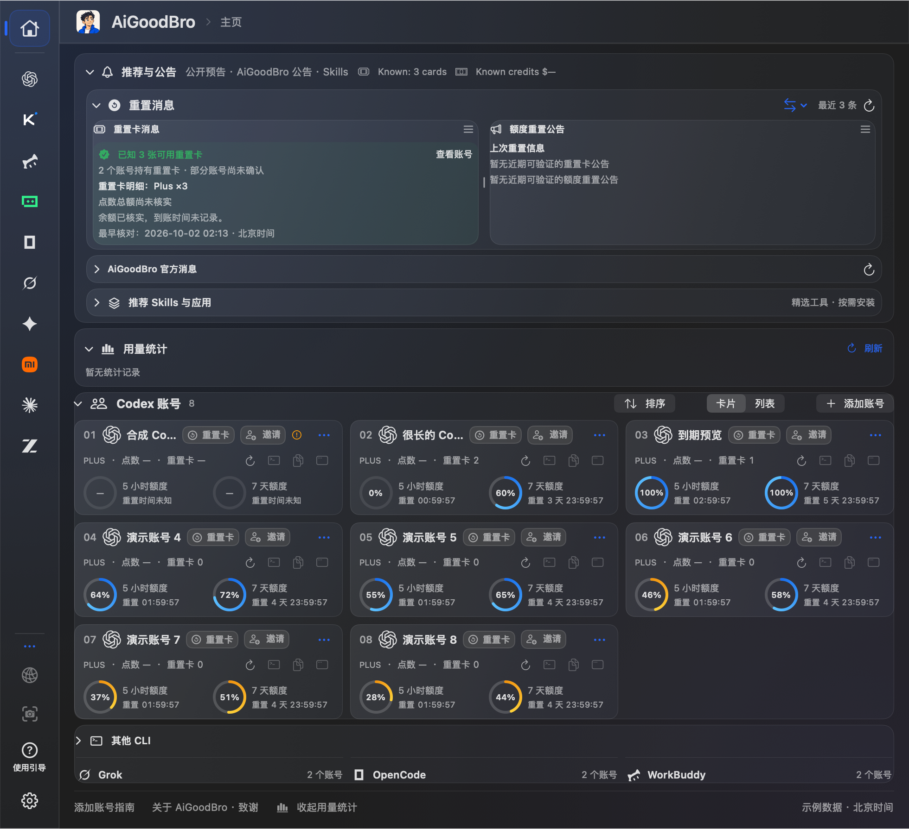
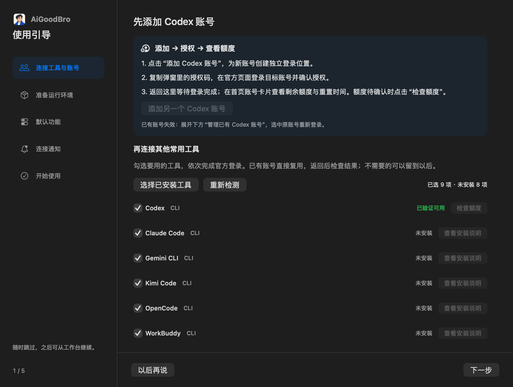

# AiGoodBro · AgentHub（2.2候选）

**看清额度、用量和任务占用；需要时，让本机任务使用自己的 Codex 账号池。**

AiGoodBro 是面向个人自用的 macOS AI 工作台，汇总 Codex 多账号额度、Token 用量、本机 CLI 和公开重置消息，并提供可选的本地反代。界面支持中文和英文，主页名为 AgentHub。

**中文** | [English](README.en.md)

最新源码候选为 **2.2 · 1005v2**，内部更新版本为 9.6.74 (124)。新增可选的临期自动使用重置卡、单行到期时间和完整悬停明细，优化反代规则排版，并为侧栏增加圆环／小鱼额度样式。本机仍运行 114 版；候选尚未安装、未发布官方安装包。见[使用说明](docs/usage-guide.md)和[变更记录](CHANGELOG.md)。

**减少重置卡过期浪费：**开启后，应用会在重置卡临近到期时自动尝试使用，减少因忘记操作而过期浪费的情况。默认关闭，逐账号选择；默认提前 30 分钟，可自行调整。应用须保持运行，仅对可核实且空闲的独立托管账号尝试，当前桌面身份不自动使用；结果不明时暂停并提示核对。详见[功能边界](docs/reset-credit-control.md)。

下方图片保留 1002v2 的来源标记；[完整图册](docs/images/1002v2/README.md)包含首页、账号、反代、设置、引导、用量浮层与九套主题。历史实机截图保留在各自版本目录。

## 一眼看懂工作状态

首页查看各账号剩余额度、重置时间和任务占用；公开重置消息与账号实际额度分开显示。用量统计汇总 Token、模型和工具活动，费用是本机数据估算，不是供应商账单。


*紧凑首页支持分区缩放、卡片与列表切换，重置消息两列共用可用宽度，并保存用户调整的比例。*

Codex 独立 CLI 可使用各自的本机登录目录；其他工具按提供商能力读取。账号卡片和列表可以刷新额度、调整顺序、选择模型或启动独立 CLI。可读取范围与限制见[账号与额度说明](docs/local-cli-accounts.md)。


*Codex 账号卡片。*

工作台会显示已连接工具的额度与状态，读取范围随工具和登录状态而异。ZCode 是桌面工具，不是 CLI；WorkBuddy 桌面额度目前不可读。Kimi CLI 页面显示上次快照，使用前请刷新确认。



*工具状态、额度和调用入口按提供商能力展示；无法读取的额度保留明确提示。*


*执行状态与成果状态分开显示，保留剩余事项和原聊天入口。*

## 使用引导：连接官方工具和账号

按引导登录官方工具或账号，再回到工作台查看连接状态；需要哪个工具时，再按需连接。



## 本机反代：把请求交给自己的账号池

本地反代是可选的个人工具。兼容客户端把模型请求发到本机代理，再由 AiGoodBro 按参与状态、优先级和保存顺序选择本人已连接的账号。全部参与账号的可用订阅额度先于点数使用；当前 Desktop 账号在每个额度阶段最后尝试。

点数接续默认关闭；只有用户主动开启后，订阅额度用尽才会进入点数档。忙碌或未知状态不算额度用尽；点数底线用于请求间的账号轮换，不是单次请求的硬限额。

反代只转发推理请求。Codex Desktop 保留自己的 OpenAI 登录身份、每段对话的模型和推理强度；使用代理不改系统认证文件或全局配置。未退出并重新接入的现有 Codex 进程不会自动改走代理。


*模拟预览展示账号队列、额度和点数底线。独立窗口使用连续的圆角玻璃背景，透明标题栏移除顶部黑色分隔线；标题栏实机效果待正常重开窗口后验收。*

**自己开启与停止：**

1. 在 AiGoodBro 中手动开启反代；应用重启后不会自动启动它。
2. 先退出 Codex。反代成功启动且连接信息就绪后，“接入桌面”按钮才会出现；点击后重新启动 Codex 并使用本机路由。
3. 工作完成后，在反代面板停用服务。关闭主窗口只会隐藏窗口；退出应用前会确认是否停止反代。停用后正常重新打开 Codex。

已开始输出的流式响应不会切换到另一个账号重放；请求结果不明时也不会自动再次发送，避免重复执行任务。反代开关和“接入桌面”入口已在候选界面中，但界面存在不等于真实端到端验收完成。

反代为个人自用场景设计，用于自己的账号和本机任务；本项目不提供账号、凭据共享、额度转售或公共代理服务。

个人微信通过腾讯官方 iLink 扫码连接，同一入口接收重置通知、查询缓存状态，并在明确开启后继续选定的 Codex 原聊天。项目工作台区分执行状态与成果状态，保留手动暂缓、取消、完成及剩余事项。普通展示不调用模型；手机收件与真实对话仍待验收。详见[微信与项目工作台](docs/wechat-workbench-0930v1.md)。

## 九套主题与原生玻璃

在设置的“外观”中选择配色，分别支持浅色和深色。默认灰保留原有中性界面；其他主题用统一的原生玻璃、颜色和渐变呈现，玻璃透明度与深度可调，系统“减少透明度”和“增强对比度”优先。

| 主题 | 视觉特点 |
|---|---|
| 默认灰 · Default | 中性灰背景与蓝紫强调色，保持默认选择。 |
| 液态键帽 · Liquid Keycap | 冷调蓝青，轻盈的玻璃层次。 |
| 青花瓷 · Blue & White Porcelain | 瓷白与钴蓝，清晰克制。 |
| 蒙特雷曙霞 · Monterey Dawn | 兰紫、粉色与黎明暖色。 |
| 千里江山 · A Thousand Li of Rivers | 青绿与矿物色。 |
| 敦煌飞天 · Dunhuang Apsara | 沙金、赭色与青绿。 |
| 故宫红墙 · Forbidden City Red | 红墙、金色与深色对照。 |
| 紫蓝流光 · Violet Glow | 默认蓝紫配色的独立玻璃背景变体。 |
| WAICY 流彩 | 粉红到橙色的三段渐变，借鉴工牌候选的色值。 |


[查看九套主题的浅色与深色预览](docs/images/1002v2/README.md#themes)。主题仅提供色值；WAICY 主题没有复制品牌图形、工牌、吉祥物或字体，也不表示官方背书。

## 当前候选与验收边界

当前源码候选是 **AiGoodBro 9.6.64 (114) · 2.2 / 1003v1**，位于 [`codex/reset-messages-0926v1`](https://github.com/BLACKIELF/AgentHub-AiGoodBro/tree/codex/reset-messages-0926v1)，由 [PR #13](https://github.com/BLACKIELF/AgentHub-AiGoodBro/pull/13) 评审。它仍是候选，尚未合并到 `main`，没有正式下载包。

[](https://github.com/BLACKIELF/AgentHub-AiGoodBro/pull/13/checks)

本机已将 **9.6.64 (114)** 覆盖安装到 `/Applications/AiGoodBro.app`；安装后核验了版本、主程序和反代 helper 哈希、签名及架构。安装前确认没有运行中的反代或占用租约，并正常退出了旧版。35 项应用自测、跨语言反代桥接回归、Go race 测试与 vet 已通过；本轮没有切换 Codex 账号，也没有发送真实模型请求。主页、设置、引导、登录、用量浮层和主题图片由原生组件离屏生成，使用模拟数据，不代表真实账号或模型请求。个人微信手机收件、原聊天真实对话、自动暂停后切号续做、真实生图与新标题栏实机效果仍待验收。详细来源和边界见[当前源码发布记录](docs/source-publication-1003v1.md)；远端 CI 以 [PR #13 检查页](https://github.com/BLACKIELF/AgentHub-AiGoodBro/pull/13/checks)为准。

构建 2.2 候选：

```sh
git clone --branch codex/reset-messages-0926v1 https://github.com/BLACKIELF/AgentHub-AiGoodBro.git AiGoodBro-2.2
cd AiGoodBro-2.2
make build
```

源码构建要求 macOS、Go 1.26+ 和经校验的 Token Monitor v0.62.0 macOS 运行时，详见[构建与发布记录](docs/source-publication-1003v1.md)。当前没有可下载的 2.2 官方安装包；Windows 后续工作仍搁置。

## 借鉴项目、代码来源与许可证

功能设计借鉴了相关开源项目；实际直接复用或适配的代码与资源在下表列明，并保留对应许可证和版权声明。

| 项目 | 来源关系 |
|---|---|
| [Tencent/openclaw-weixin 2.4.9](https://github.com/Tencent/openclaw-weixin/tree/24de5c9eb0dd5e595d7e2d090ed8a3f82870d42c) | iLink 协议与扫码流程的原生适配；MIT 声明保留，不安装 OpenClaw。 |
| [codexU](https://github.com/shanggqm/codexU) | 历史固定源码的二次开发与宿主适配：SwiftUI、额度、配色和 Windows 基础承接后由 AiGoodBro 维护。 |
| [Token Monitor v0.62.0](https://github.com/Javis603/token-monitor/tree/dcccfb01557e2786888fd5479552f392ac6c0d32) | 基于固定上游源码的二次开发与原生集成：统计引擎、桌面看板、图表和资源随包保留，AiGoodBro 通过 bridge、hooks 和 Swift 外壳接入。v0.63 以后上游更新的适用性与本机已有零额度修复见[本轮发布记录](docs/source-publication-1003v1.md)。 |
| [Tokscale fork](https://github.com/Javis603/tokscale) · [原项目](https://github.com/junhoyeo/tokscale) | 基于固定提交的二次开发与原生集成；统计采集基础和许可证随包保留，打包修订为 `06a9f1625d5a505f01b39eff29f7be44a2c52188`。 |
| [CLIProxyAPI v8.0.2](https://github.com/router-for-me/CLIProxyAPI/tree/v8.0.2) | 固定上游代码的宿主适配：复用 SDK 调度、Codex 执行器和 Responses 处理器，并窄适配 v8.0.7 首帧前断流的 502/failover 行为；未升级整套依赖。 |
| [Codex-Manager](https://github.com/qxcnm/Codex-Manager) | 协议适配与静态研究参考；暖号请求结构与 SSE 完成规则独立实现，见 [`CodexAccountActions.swift`](Sources/CodexUsageWidget/Services/CodexAccountActions.swift#L850)。 |
| [Hazmat wrapper 脚本](https://github.com/dredozubov/hazmat/blob/c112d222bb53e888dd17a8927927286792f7c20e/scripts/check-codex-desktop-attach-smoke.sh) | 协议适配与静态研究参考：仅参考 `CODEX_CLI_PATH` 的 stdio wrapper 入口，未集成 Hazmat 沙箱或服务。 |
| [BlackHole1/aswap v1.1.0](https://github.com/BlackHole1/aswap/releases/tag/v1.1.0) | X 帖子对应的 Claude 多账号 CLI/Chrome 资料隔离工具；协议适配与静态研究参考，未复制、未打包，也未接入 Codex、Feishu 或企业微信。 |

AiGoodBro 使用 [MIT 许可证](LICENSE)。第三方完整许可和版权文本见 [`Resources/THIRD_PARTY_NOTICES.txt`](Resources/THIRD_PARTY_NOTICES.txt)、[`Companion/LocalProxy/LICENSE.CLIProxyAPI`](Companion/LocalProxy/LICENSE.CLIProxyAPI)、[`Companion/LocalProxy/LICENSE.Hazmat`](Companion/LocalProxy/LICENSE.Hazmat) 与 [`Companion/LocalProxy/THIRD-PARTY-NOTICES.txt`](Companion/LocalProxy/THIRD-PARTY-NOTICES.txt)。

## 延伸阅读

[详细使用说明](docs/usage-guide.md) · [本机 CLI 额度范围](docs/local-cli-accounts.md) · [反代实现与验证记录](docs/local-proxy-0928v1.md) · [当前源码发布记录](docs/source-publication-1003v1.md) · [历史实机截图：0929v2](docs/images/0929v2/README.md) · [历史截图：0927v6](docs/images/0927v6/README.md) · [历史截图：0910v1](docs/images/0910v1/README.md) · [问题反馈](https://github.com/BLACKIELF/AgentHub-AiGoodBro/issues) · [安全说明](SECURITY.md)

[MIT 许可证](LICENSE) · [第三方声明](Resources/THIRD_PARTY_NOTICES.txt) · [品牌兼容表](docs/brand-compat-0911v1.md)
