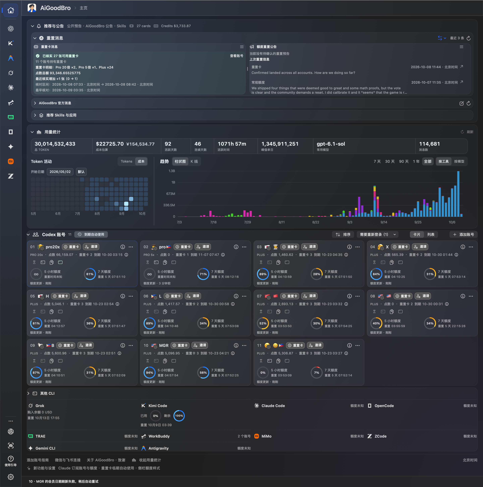
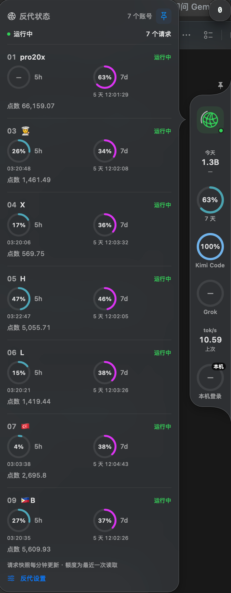
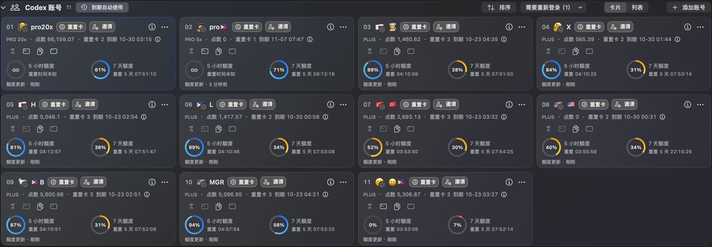
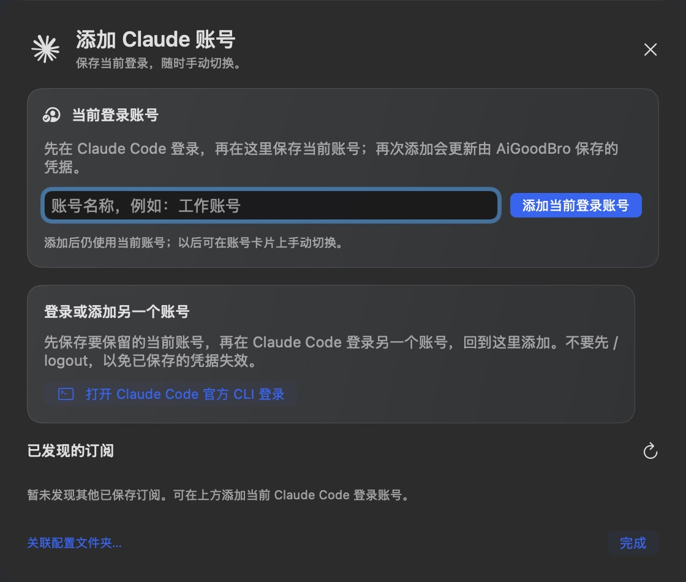
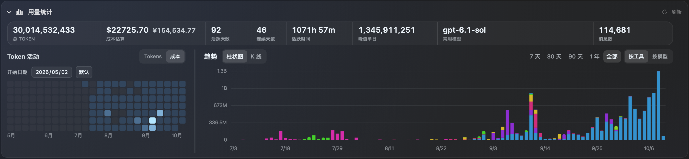
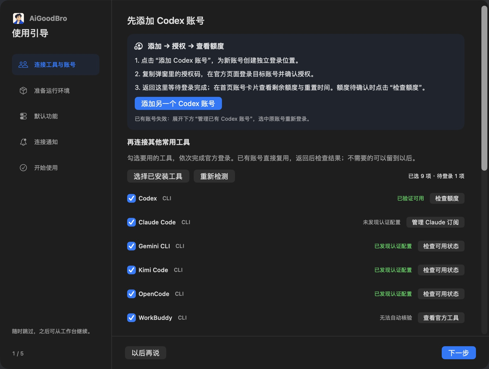
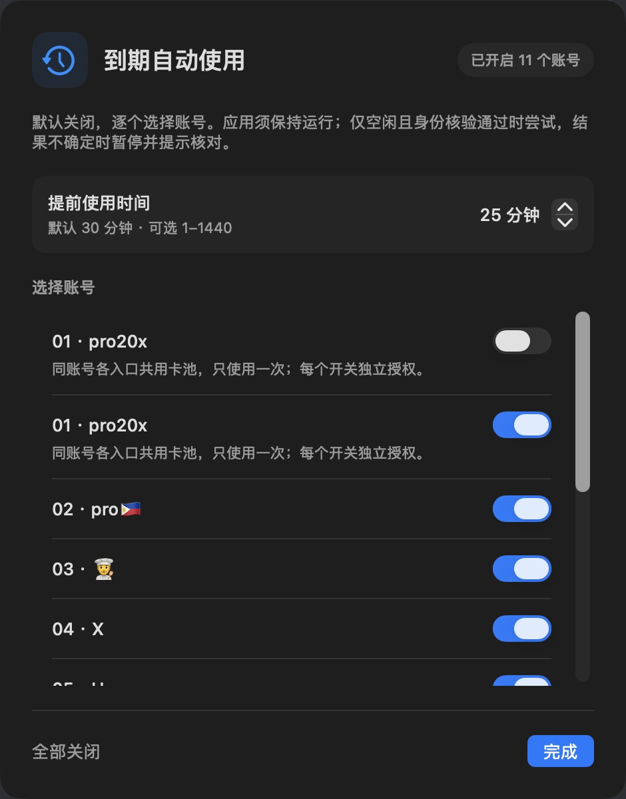
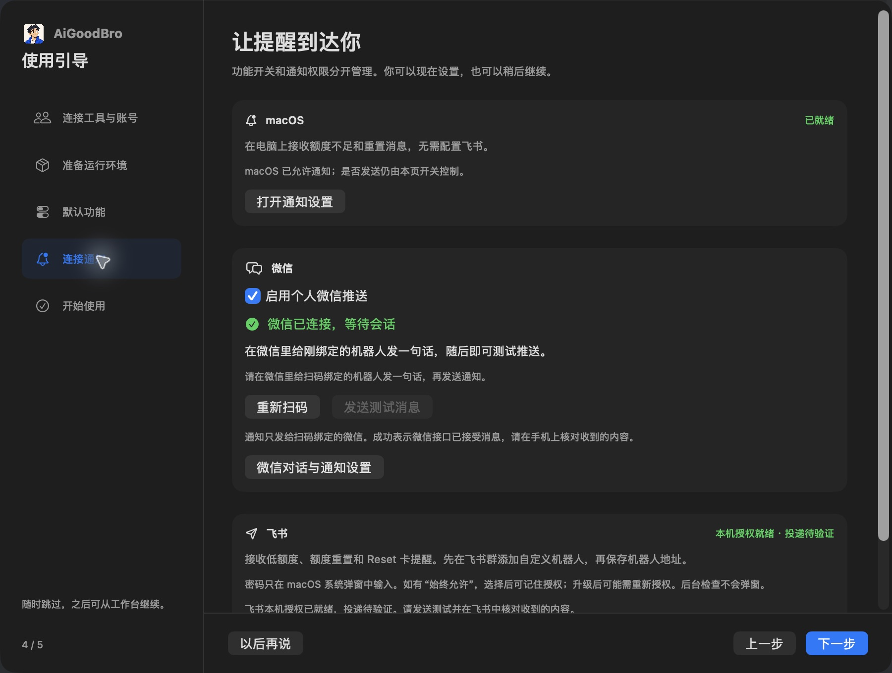
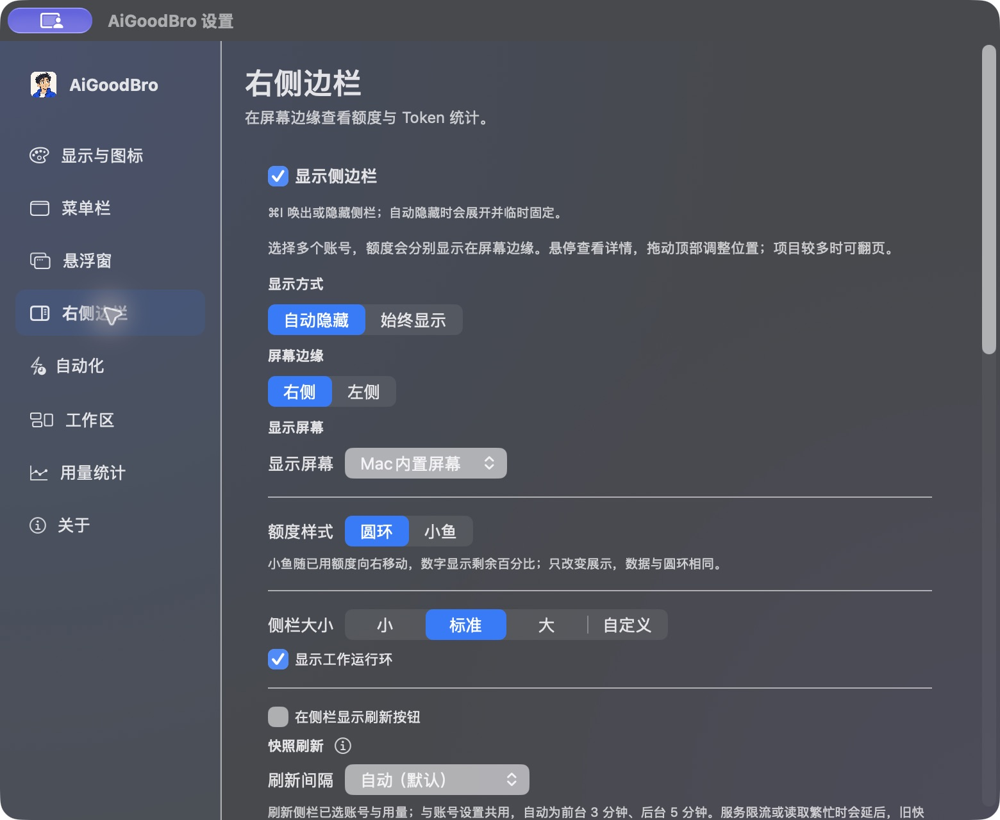
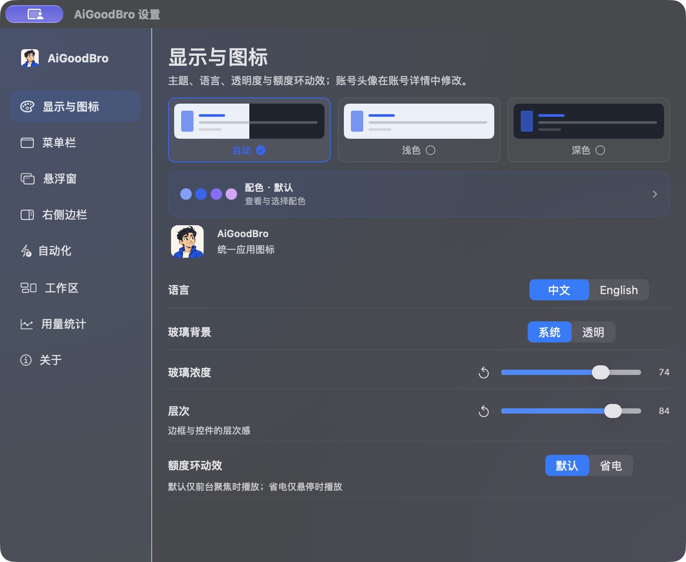

# AiGoodBro · AgentHub（2.4）

**把额度、用量、重置消息和本机任务放在一页看清；需要时，让任务使用自己的 Codex 账号池。**

AiGoodBro 是面向个人自用的 macOS AI 工作台。它集中查看 Codex 多账号、Claude 订阅、已连接 CLI 的额度与状态，统计 Token 用量，接收公开重置消息，并提供可选的本地反代。界面支持中文和 English，主页名称为 AgentHub。

[中文] | [English](README.en.md)

本页介绍 **2.4.0（141）· 1009v2** 的功能。相较 GitHub 公开的 9.6.80（130），本版固定 Token Monitor 0.68.0、TokScale 4.18.0 与 CLIProxyAPI 8.0.20，并保留现有 AiGoodBro 定制。下载链接是否可用，以 [GitHub Releases](https://github.com/BLACKIELF/AgentHub-AiGoodBro/releases) 的实际状态为准。

[DMG（Apple Silicon）](https://github.com/BLACKIELF/AgentHub-AiGoodBro/releases/download/v2.4.0/AiGoodBro-2.4.0-mac-arm64.dmg) · [ZIP 备用包](https://github.com/BLACKIELF/AgentHub-AiGoodBro/releases/download/v2.4.0/AiGoodBro-2.4.0-mac-arm64.zip) · [发布说明](docs/release-notes-v2.4.0.md)

[主界面](#main) · [重置消息](#reset-messages) · [反代](#proxy) · [账号](#accounts) · [Claude](#claude) · [Token Monitor](#usage) · [其他 CLI](#other-cli) · [重置卡自动使用](#reset-cards) · [邀请](#referrals) · [微信](#wechat) · [飞书](#feishu) · [侧栏](#dock) · [任务占用](#tasks) · [引导与更新](#setup) · [主题](#themes) · [下载与构建](#downloads) · [源码与文档](#sources)

<a id="main"></a>

## 01 · 主界面：一页看清工作状态

**它是做什么的：** 主界面把最常用的状态集中起来：顶部是公告和重置消息，中央是已连接工具与推荐入口，下面是 Token 用量统计，底部是 Codex 账号、Claude 订阅和其他工具状态。公开公告、账号真实额度、用量统计和任务占用分开显示，避免把不同来源的数字混在一起。

**怎么进入：** 启动 AiGoodBro 后进入 AgentHub 主页；点击分区标题可展开或收起，账号区可在“卡片／列表”间切换，分区宽度和部分缩放设置会保存在本机。

<p align="center">
  <a href="docs/images/1009v1/home-live.png"></a>
</p>

*真实界面长图，采集于已安装的 2.3.0（137）。图中数据是拍摄时的本机快照，不代表 141 已安装或真实调用验收；新增设置图采集于 2.3.0（139），141 沿用相同呈现。完整来源、尺寸和校验值见[截图记录](docs/public-ui-1009v2.md)。*

**主界面上几个数字各自代表什么：**

- **重置消息**是公开消息源的公告和历史记录，不等于某个账号已经读到的官方额度。
- **可用点数（点）**是已读取账号的点数快照；**可用金额（美元）**是公开重置记录里读取到的金额，不把二者相加，也不把未知值写成 0。
- **Token 总量、成本和趋势**来自本机用量记录；成本是估算值，不是供应商账单。
- **账号卡片**显示账号身份、5 小时／7 天窗口、重置时间、重置卡和任务占用；缺少可信返回时显示“—”或旧快照标记。

<a id="reset-messages"></a>

## 02 · 重置消息：先看公开公告，再核对账号

**它是做什么的：** “重置消息”用于接收和查看公开的额度重置公告，帮助判断最近是否出现新的重置、公告内容和待确认状态。它与账号额度读取分开，不能用公告替代账号核验，也不会因为看到公告就自动兑换重置卡。

**怎么使用：** 在主页的“重置消息”分区打开消息列表；“最近 3 条”用于快速浏览，展开后可查看公告来源、时间和状态。首次建立历史基线，之后只提示新消息；历史读取失败会保留已核验内容并标出缺口。

<p align="center">
  <a href="docs/images/1009v1/home-live.png"></a>
</p>

*同一张真实首页图用于说明重置消息在主界面中的位置；它不是单独的公告详情截图，公告和额度仍按各自来源显示。*

**消息和账号数据的边界：** 公开消息不会改写账号官方重置记录，不会改变参与调度、优先级或点数底线，也不会自动发送任务。若要执行重置卡，请使用下方的“重置卡自动使用”入口，并逐账号明确开启。

<a id="proxy"></a>

## 03 · 本机反代：把请求交给自己的账号队列

**它是做什么的：** 本地反代是一个可选的本机服务。兼容客户端把模型请求发到本机端点，AiGoodBro 再按照账号的参与状态、优先级、最后使用和保存顺序选择本人已经连接的账号。它适合个人账号池和本机任务，不是公共代理，也不提供账号或额度转售。

<p align="center">
  <a href="docs/images/1009v1/proxy-status-edge-dock.png"></a>
</p>

*这张是已公开的真实状态局部图，未显示版本号，也不是反代设置页；只用于说明状态入口和信息层级，不作为 141 安装或真实请求验收证据。*

**怎么开启：**

1. 在 AiGoodBro 的反代面板手动点击“开启反代”；应用重启后不会自动启动。
2. 等待连接信息就绪，退出 Codex 后使用“接入桌面”重新启动并接入本机路由。已经运行的 Codex 进程不会自动改走反代。
3. 完成任务后在面板点击“停止反代”。关闭主窗口只会隐藏窗口；退出应用时会询问是否停止服务。

**队列怎么工作：** 参与、优先、最后使用和排序只影响新请求，并与账号页同步；Pro20x 默认最后使用，可调整。订阅额度先于点数，点数接续默认关闭，用户主动开启后才会在额度耗尽时进入点数档。忙碌或未知账号不会被当成额度耗尽。

运行中取消参与后，尚未准入的等待和重试会跳过该账号，已经接入的流式响应继续完成。网关拒绝、超时、取消和普通转发失败分别提示；HTTP 503 保留，不自动重连。已确认退出的子进程清理租约时，忙碌锁最多短暂重试 3 次，并保护新的运行和仍活跃的子进程。历史“必须重启才恢复”的故障根因仍未完全确认，不能把本次修复写成永久稳定保证。

<a id="accounts"></a>

## 04 · Codex 账号：额度、重置卡和任务占用

**它是做什么的：** 账号区把多个 Codex 身份放在同一页，显示 5 小时／7 天额度、重置时间、点数、重置卡、最近到期时间和任务占用。卡片适合快速浏览，列表适合逐行调整；刷新、排序、备注、邀请和独立 CLI 入口保留。

**怎么使用：** 点击账号区的“卡片／列表”切换；点击刷新读取最新快照；点击账号卡中的信息、设置或更多按钮查看动作。参与、调度、优先和最后使用等入口按现有功能各自保存，反代参与和优先会与反代面板同步，并用于后续新请求。

<p align="center">
  <a href="docs/images/1009v2/accounts-home-137-crop.png"></a>
</p>

*这是经授权从公开 2.3.0（137）首页原图裁出的完整账号区，区域内像素和数据未修改；不是 141 新布局的实拍。窄窗口的 Codex 专用列表控件挤压问题按用户决定留到下一版，当前可用卡片模式或加宽窗口。*

<a id="claude"></a>

## 05 · Claude 订阅：官方登录、保存和切换

**它是做什么的：** Claude 区用于管理 Claude Code 订阅身份、刷新额度和手动切换；它把 5 小时、7 天和官方实际返回的独立模型额度分开显示，缺失额度保持未知。

**怎么使用：** 先在官方 Claude Code CLI 完成登录，再在 AiGoodBro 里核验身份并点击“添加当前登录账号／保存订阅”。已有 Claude-swap 订阅可以关联；要添加另一个账号，先保存当前订阅，再回到官方 CLI 登录另一个账号后添加。不要先 `/logout`，否则可能使已保存凭据失效。保存后可手动切换和刷新额度。

<p align="center">
  <a href="docs/images/1009v2/claude-login.jpg"></a>
</p>

*登录入口的出现不等于登录或额度读取已成功；必须完成官方登录、身份核验和保存。活跃或身份未知的订阅不能解除关联，过期目标只有用户明确切换时才按 Claude-swap 流程续期。*

<a id="usage"></a>

## 06 · Token Monitor：用量、热图、趋势和 TPM

**它是做什么的：** 内置 Token Monitor 用来集中查看 Token 用量、估算成本、活动热图、趋势、模型、项目和会话；上游覆盖 **35+ 种工具的 Token 用量追踪、28+ 家提供方的额度检测**。这是上游支持范围，不代表本机每个工具都已经登录或能读取额度。

**怎么使用：** 主页展开“用量统计”查看总量、成本、热图和趋势；从侧栏或菜单栏打开统计入口查看更细的工具、模型、项目、会话和额度视图，再选择时间范围或数据来源。Token Monitor 0.68.0 和 TokScale 4.18.0 更新解析与定价，修正 Claude 重复及缓存 Token 统计。

<p align="center">
  <a href="docs/images/1009v2/usage-home-137-crop.png"></a>
</p>

*裁剪图保留原始像素和拍摄时的本机数据；35+／28+ 是固定上游支持范围。顶部、浮窗底部和侧栏共用缓存的 TPM（每分钟 Token 消耗量），不为显示速率额外频繁刷新。*

<a id="reset-cards"></a>

<a id="other-cli"></a>

## 07 · 其他 CLI：连接状态和额度分开核对

**它是做什么的：** 这一组入口把已经连接的 Kimi、Grok、OpenCode、WorkBuddy、ZCode 和 TRAE SOLO 集中列出，方便知道“登录是否存在”和“额度是否真的读到”是两件事。上游支持数量不等于本机已经接通数量。

**怎么使用：** 在“使用引导”或工具入口选择对应产品，按该产品的官方登录方式完成登录，再回到 AiGoodBro 点击刷新额度。Kimi CLI 的旧快照使用前要刷新；Grok 使用官方 `grok login --oauth`；OpenCode 使用 `opencode auth login`；WorkBuddy、ZCode 和 TRAE SOLO 只使用各自官方桌面或 CLI 入口。未知、过期或没有可信返回时，界面保留“—”或旧快照，不把退出码当成额度成功。

<p align="center">
  <a href="docs/images/1009v2/guide.jpg"></a>
</p>

*图中 Kimi Code 显示已发现认证配置，只证明本地配置被发现；它不证明额度读取成功或后续模型调用一定可用。详细覆盖边界见[本机 CLI 额度范围](docs/local-cli-accounts.md)。*

## 08 · 重置卡自动使用：减少临期忘记操作

**它是做什么的：** 账号旁只显示最近一张重置卡的到期时间，鼠标悬停可查看全部已知到期时间，避免增加卡片行数。临期自动使用用于减少“卡到期了才想起来”的浪费，不会因为打开入口就自动扣卡。

**怎么使用：** 在主页或 Codex 账号区点击“重置卡 N”、到期时间或信息按钮，进入“到期自动使用”；逐账号选择是否开启，并设置提前时间。默认关闭、默认提前 30 分钟，可调整为 1–1440 分钟。桌面账号或同身份镜像只在独立入口、可信身份和空闲状态都核验通过时尝试；结果不明会暂停并提示人工核对，不反复重发。

<p align="center">
  <a href="docs/images/1009v2/reset-auto.jpg"></a>
</p>

*图中 25 分钟是拍摄时的自定义值，产品默认仍为 30 分钟。使用前必须逐账号授权，并保持应用运行；设置页本身不会兑换卡片。详细边界见[重置卡说明](docs/reset-credit-control.md)。*

<a id="referrals"></a>

## 09 · 邀请好友：邀请和点数集中查看

**它是做什么的：** 账号卡保留邀请入口，用于批量邀请、查看官方邀请状态和邀请点数，省去切换到其他页面核对。

**怎么使用：** 点击目标账号的邀请按钮或小图标，按官方页面完成收件人填写和确认，再刷新查看状态。每次最多 5 个地址；账号或登录状态变化时应关闭并重新打开邀请窗口。奖励到账以官方条件和返回结果为准，接受邀请不等于点数已经到账。

<p align="center">
  <a href="docs/images/1009v1/home-live.png"></a>
</p>

*当前没有把邀请结果伪装成成功；主界面图只用于标注入口位置，具体状态必须以邀请窗口的官方返回为准。*

<a id="wechat"></a>

## 10 · 微信：额度和重置提醒

**它是做什么的：** 个人微信用于接收额度、重置和重置卡消息，也可以在用户明确开启后继续指定的 Codex 原聊天。连接状态和消息是否真正送达分开显示。

**怎么使用：** 在“设置 → 通知／微信”进入连接引导，使用腾讯官方 iLink 扫码绑定；确认会话后选择要接收的消息类型。首次建立历史基线，之后只发送新消息；查询缓存状态不会消耗账号额度。微信未完成会话时，界面显示等待状态，不把“已配置”写成“已送达”。

<p align="center">
  <a href="docs/images/1009v2/notifications-guide.jpg"></a>
</p>

*这张图同时包含微信和飞书设置；它用于说明入口和状态分层，不证明手机端真实送达。*

<a id="feishu"></a>

## 11 · 飞书：可选的消息投递

**它是做什么的：** 飞书用于接收 Agent、账号备注、额度、重置日期、重置卡到期明细和官方余额等消息；默认保持简洁，不把长任务编号塞进卡片正文。

**怎么使用：** 在通知引导中粘贴机器人地址并点击“保存并连接”；已有连接需要钥匙串授权时点击“授权连接”。Webhook 保存在 macOS Keychain，不回填到界面或日志；真实测试发送必须由用户明确点击。当前引导图显示本机授权就绪，但投递仍待真实验证，不能把授权状态当成送达成功。

<p align="center">
  <a href="docs/images/1009v2/notifications-guide.jpg"></a>
</p>

<a id="dock"></a>

## 12 · 侧栏和状态浮窗：随时看一眼

**它是做什么的：** 屏幕边缘侧栏用于快速查看选定账号额度、重置倒计时、Token 统计和反代状态；浮窗展开后可看账号列表、5h／7d 圆环和点数。它复用已有快照，不会为了动画持续轮询。

**怎么使用：** 默认用 **⌘I** 唤出或隐藏；侧栏顶部图钉可以固定，再次点击隐藏；悬停展开详情，拖动顶部调整位置。设置中可选圆环或小鱼样式、75–150% 缩放、刷新按钮、运行指示和触控板轻触反馈。缺少额度时显示“—”，不推算成 0。

<p align="center">
  <a href="docs/images/1009v2/edge-dock-settings.jpg"></a>
</p>

<a id="tasks"></a>

## 13 · 任务占用、调度和暖号：避免互相抢账号

**它是做什么的：** 任务占用把准备、运行、维护和待验收状态写入本机记录，账号页和调度器据此知道哪些账号正在使用。调度参与时段、优先级和暖号是已有的自动化能力，不等于自动把所有账号派给新任务。

**怎么使用：** 在账号自动化或设置中开启“剩余 1% 自动暂停并换号”或“换号成功后自动继续原任务”；软件会先保存任务与轮次，核验备用账号和任务状态后再切换。暖号会在额度窗口到期后先刷新，再按条件请求，忙碌、低额度或结果不明时等待或暂停。没有可信任务状态时保持关闭，不制造成功通知。

<p align="center">
  <a href="docs/images/1009v1/home-live.png"></a>
</p>

<a id="setup"></a>

## 14 · 工具连接、安装引导和更新提醒

**它是做什么的：** 对可识别的新装或覆盖安装，引导负责把登录、通知连接和新功能设置分开，并询问新用户／老用户。新用户检查完整功能，老用户重点检查微信、飞书和新设置并保留既有配置。无法可靠识别为新安装的原位替换不会强行重复弹窗。手动 Claude 引导不会覆盖安装引导的进度。

**怎么使用：** 打开“使用引导”按步骤连接官方工具；Claude、Kimi、Grok、OpenCode、WorkBuddy、ZCode 和 TRAE SOLO 均按各自官方入口登录。更新弹窗展示版本和更新点，用户点击后下载，校验大小与 SHA256 后再自行覆盖安装；下载不会自动退出或替换当前 App，也不会自动开启可选功能。

<p align="center">
  <a href="docs/images/1009v2/guide.jpg"></a>
</p>

*图中 Kimi Code 显示“已发现认证配置”，不代表额度读取成功；登录、刷新和真实调用仍按工具状态单独核验。*

<a id="themes"></a>

## 15 · 主题和原生玻璃

**它是做什么的：** 外观设置统一管理明暗模式、主题颜色、玻璃透明度和层次，解决不同主题下文字不明显的问题；系统“减少透明度”和“增强对比度”优先。

**怎么使用：** 打开“设置 → 显示与图标”，选择主题、语言和玻璃浓度。当前保留九套主题：默认灰、液态键帽、青花瓷、蒙特雷曙霞、千里江山、敦煌飞天、故宫红墙、紫蓝流光、WAICY 流彩。WAICY 主题只使用色值，不复制品牌图形、字体或吉祥物。

<p align="center">
  <a href="docs/images/1009v2/appearance-settings.jpg"></a>
</p>

<a id="downloads"></a>

## 16 · 下载、升级与构建

本版只提供 **macOS 13+、Apple Silicon ARM64**。安装包为本地 ad-hoc 签名，未做 Apple 公证。9.6.x 旧客户端按 SemVer 会把 2.4.0 视为更低版本，需手动下载 DMG／ZIP 覆盖；2.3.0 可正常发现 2.4.0。覆盖前结束自己的任务、正常退出旧版并备份旧 App 和本机数据；重新打开后核对 2.4.0（141）／1009v2，并按引导检查微信、飞书和新设置。

本地最终候选的 35 组原生自测、资源校验、完整递归签名、DMG／ZIP 文件树和 SHA256 校验记录见[2.4 发布记录](docs/release-notes-v2.4.0.md)。这些检查不等于真实账号登录、真实提供方调用、重置卡兑换、微信／飞书送达或全局快捷键实机验收；141 安装和真实反代稳定性仍应以用户现场为准。

```sh
git clone --branch v2.4.0 https://github.com/BLACKIELF/AgentHub-AiGoodBro.git AiGoodBro-2.4
cd AiGoodBro-2.4
make build
```

构建需要 macOS、Go 1.26+ 和经 SHA256 校验的 Token Monitor 0.68.0 macOS 运行时；不提供 Intel 或 Windows 安装包。

<a id="sources"></a>

## 17 · 源码、许可证与文档

下表列出实际复用、适配或静态研究参考的项目；对应许可证和版权声明随仓库保留。借鉴上游功能不等于把上游的测试样例或品牌素材写成 AiGoodBro 的真实能力。

| 项目 | 来源关系 |
|---|---|
| [Tencent/openclaw-weixin 2.4.9](https://github.com/Tencent/openclaw-weixin/tree/24de5c9eb0dd5e595d7e2d090ed8a3f82870d42c) | iLink 协议与扫码流程的原生适配；保留 MIT 声明，不安装 OpenClaw。 |
| [codexU](https://github.com/shanggqm/codexU) | 历史固定源码的二次开发与宿主适配；SwiftUI、额度、配色和 Windows 基础由 AiGoodBro 继续维护。 |
| [Token Monitor v0.68.0](https://github.com/Javis603/token-monitor/tree/5d2db368d8313415763860d594de00e46a663418) | 固定源码与官方 macOS 运行时的宿主适配；统计引擎、桌面看板、图表和资源随包保留。 |
| [TokScale 4.18.0 fork](https://github.com/Javis603/tokscale/tree/d5e8ad9b25bfafb43b5b6804940929b728a6f48a) · [原项目](https://github.com/junhoyeo/tokscale) | 固定修订用于统计采集和定价；许可证随包保留。 |
| [CLIProxyAPI v8.0.20](https://github.com/router-for-me/CLIProxyAPI/tree/v8.0.20) | 固定 Go SDK 的调度、Codex 执行器和 Responses 处理器宿主适配；保留身份、额度、点数底线和流式响应不重放检查。 |
| [Codex-Manager](https://github.com/qxcnm/Codex-Manager) | 协议适配与静态研究参考；暖号请求和 SSE 完成规则独立实现。 |
| [Hazmat wrapper 脚本](https://github.com/dredozubov/hazmat/blob/c112d222bb53e888dd17a8927927286792f7c20e/scripts/check-codex-desktop-attach-smoke.sh) | 仅参考 `CODEX_CLI_PATH` 的 stdio wrapper 入口，未集成 Hazmat 沙箱或服务。 |
| [BlackHole1/aswap v1.1.0](https://github.com/BlackHole1/aswap/releases/tag/v1.1.0) | Claude 多账号 CLI／Chrome 资料隔离工具的协议适配与静态参考；未复制、未打包。 |

AiGoodBro 使用 [MIT 许可证](LICENSE)。第三方许可见 [`Resources/THIRD_PARTY_NOTICES.txt`](Resources/THIRD_PARTY_NOTICES.txt)、[`Companion/LocalProxy/LICENSE.CLIProxyAPI`](Companion/LocalProxy/LICENSE.CLIProxyAPI)、[`Companion/LocalProxy/LICENSE.Hazmat`](Companion/LocalProxy/LICENSE.Hazmat) 和 [`Companion/LocalProxy/THIRD-PARTY-NOTICES.txt`](Companion/LocalProxy/THIRD-PARTY-NOTICES.txt)。

文档入口：[详细使用说明](docs/usage-guide.md) · [本机 CLI 额度范围](docs/local-cli-accounts.md) · [反代实现与验证](docs/local-proxy-0928v1.md) · [2.4 发布记录](docs/release-notes-v2.4.0.md) · [截图来源与校验](docs/public-ui-1009v2.md) · [问题反馈](https://github.com/BLACKIELF/AgentHub-AiGoodBro/issues) · [安全说明](SECURITY.md)
