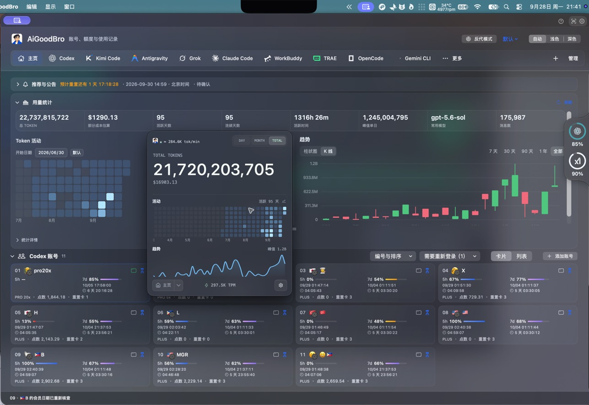
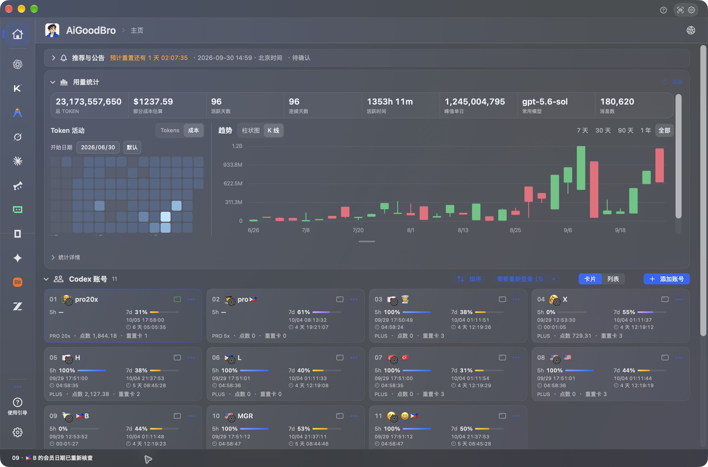
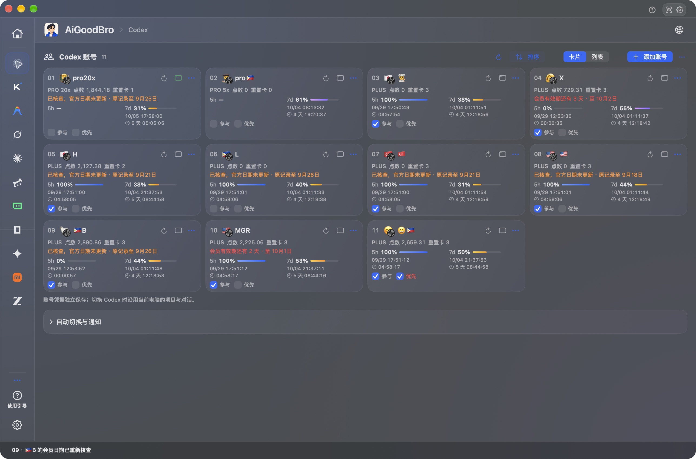
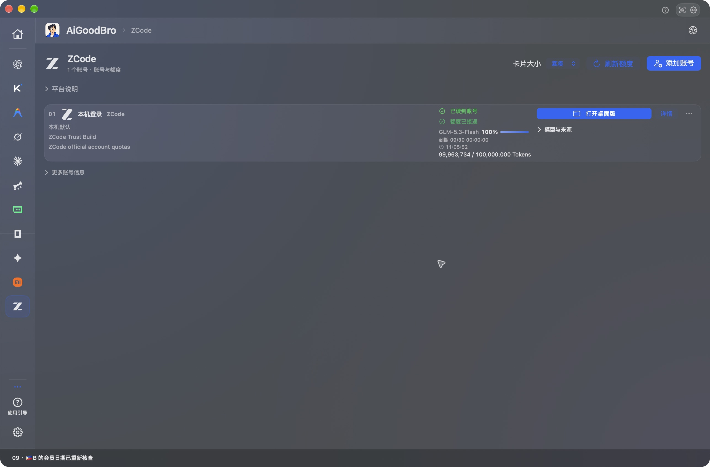
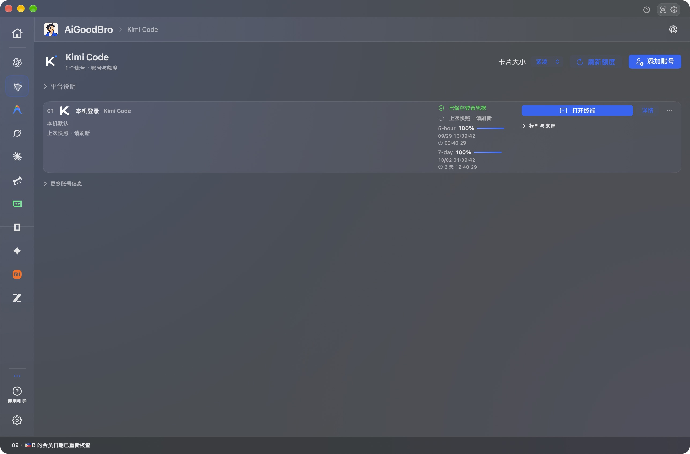
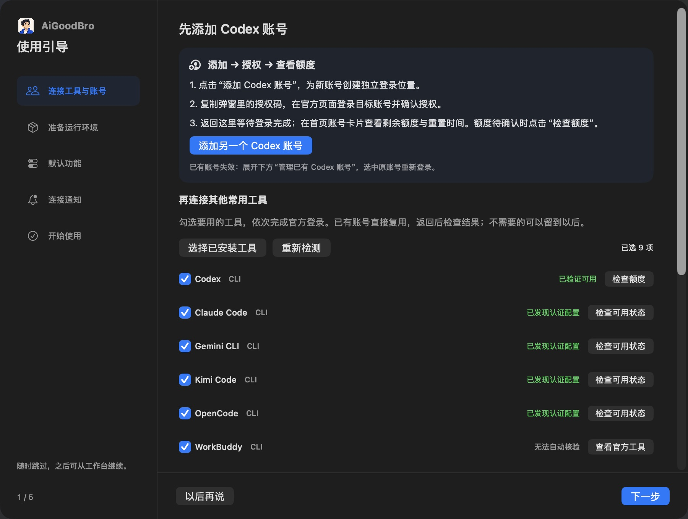
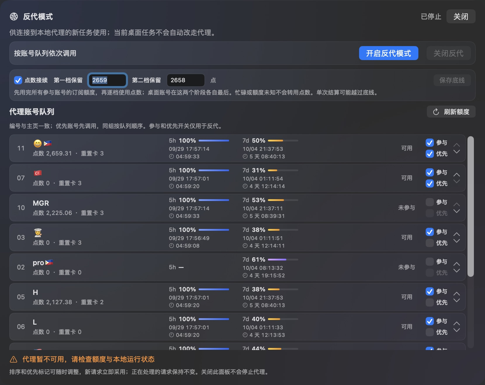

# AiGoodBro 2.0 · AgentHub

**看清额度、用量和任务占用；需要时，让本机任务使用自己的 Codex 账号池。**

AiGoodBro 是面向个人自用的 macOS AI 工作台，汇总 Codex 多账号额度、Token 用量、本机 CLI 和公开重置消息，并提供可选的本地反代。界面支持中文和英文，主页名为 AgentHub。

**中文** | [English](README.en.md)

*首图由用户提供，展示工作台总览与浮动用量卡片；图中数据仅代表截图时状态。[图片来源说明](docs/images/0929v4/README.md)*

以下六张界面图来自 9.6.32 (82) 于 2026-09-29 的实机截图，逐图边界与来源见[截图说明](docs/images/0929v2/README.md)。

## 一眼看懂工作状态

首页查看各账号剩余额度、重置时间和任务占用；公开重置消息与账号实际额度分开显示。用量统计汇总 Token、模型和工具活动，费用是本机数据估算，不是供应商账单。



*用量总览、活动热图、趋势和账号额度放在同一页。*

Codex 独立 CLI 可使用各自的本机登录目录；其他工具按提供商能力读取。账号卡片和列表可以刷新额度、调整顺序、选择模型或启动独立 CLI。可读取范围与限制见 [账号与额度说明](https://github.com/BLACKIELF/AgentHub-AiGoodBro/blob/codex/reset-messages-0926v1/docs/local-cli-accounts.md)。



*Codex 账号卡片。*

工作台会显示已连接工具的额度与状态，读取范围随工具和登录状态而异。下面的 ZCode 截图展示桌面端页面；WorkBuddy 桌面额度目前不可读。Kimi CLI 页面显示上次快照，使用前请刷新确认。



*ZCode 桌面账号页集中展示模型、到期时间和 Token 余额。*



*Kimi 显示上次读取的快照；使用前请刷新。*

## 使用引导：连接官方工具和账号

按引导登录官方工具或账号，再回到工作台查看连接状态；需要哪个工具时，再按需连接。



## 本机反代：把请求交给自己的账号池

本地反代是可选的个人工具。兼容客户端把模型请求发到本机代理，再由 AiGoodBro 按参与状态、优先级和保存顺序选择本人已连接的账号。全部参与账号的可用订阅额度先于点数使用；当前 Desktop 账号在每个额度阶段最后尝试。

点数接续默认关闭；只有用户主动开启后，订阅额度用尽才会进入点数档。忙碌或未知状态不算额度用尽；点数底线用于请求间的账号轮换，不是单次请求的硬限额。

反代只转发推理请求。Codex Desktop 保留自己的 OpenAI 登录身份、每段对话的模型和推理强度；使用代理不改系统认证文件或全局配置。未退出并重新接入的现有 Codex 进程不会自动改走代理。



*截图时反代已停止，并显示暂不可用提示；图片仅展示控制项，未为截图开启反代或验证请求转发。*

**自己开启与停止：**

1. 在 AiGoodBro 中手动开启反代；应用重启后不会自动启动它。
2. 先退出 Codex。反代成功启动且连接信息就绪后，“接入桌面”按钮才会出现；点击后重新启动 Codex 并使用本机路由。
3. 工作完成后，在反代面板停用服务。关闭主窗口只会隐藏窗口；退出应用前会确认是否停止反代。停用后正常重新打开 Codex。

已开始输出的流式响应不会切换到另一个账号重放；请求结果不明时也不会自动再次发送，避免重复执行任务。反代入口已在 2.0 候选界面中，但界面存在不等于真实端到端验收完成。

反代为个人自用场景设计，用于自己的账号和本机任务；本项目不提供账号、凭据共享、额度转售或公共代理服务。

## 2.0 项目状态与使用边界

本页是 **AiGoodBro 2.0 · AgentHub** 的项目介绍。最新 2.0 实现与源码整合在 [PR #13](https://github.com/BLACKIELF/AgentHub-AiGoodBro/pull/13) 的候选分支 [`codex/reset-messages-0926v1`](https://github.com/BLACKIELF/AgentHub-AiGoodBro/tree/codex/reset-messages-0926v1)；`main` 仍是现有代码基线，2.0 下载包尚未发布。Windows 工作已暂停。

完整的实现来源、验证范围和未覆盖行为见[候选源码发布记录](https://github.com/BLACKIELF/AgentHub-AiGoodBro/blob/codex/reset-messages-0926v1/docs/source-publication-0929v1.md)与[反代集成记录](https://github.com/BLACKIELF/AgentHub-AiGoodBro/blob/codex/reset-messages-0926v1/docs/local-proxy-0928v1.md)。当前 Desktop 路由、真实反代生图、长对话恢复、自动暂停→切号→续做及最终界面回归仍待实机验收。

构建最新 2.0 候选：

```sh
git clone --branch codex/reset-messages-0926v1 https://github.com/BLACKIELF/AgentHub-AiGoodBro.git AiGoodBro-2.0
cd AiGoodBro-2.0
make build
```

构建上述 2.0 候选要求 Go 1.26+ 和经校验的 Token Monitor v0.62.0 macOS 运行时，详见[候选源码发布记录](https://github.com/BLACKIELF/AgentHub-AiGoodBro/blob/codex/reset-messages-0926v1/docs/source-publication-0929v1.md)。若需现有主线，可从 `main` 构建；它是当前基线，不含 2.0 候选 82。当前没有可下载的 2.0 安装包。

## 借鉴项目、代码来源与许可证

2.0 候选的功能设计借鉴了相关开源项目；候选中实际直接复用或适配的代码与资源在下表列明，并保留对应许可证和版权声明。

| 项目 | 来源关系 |
|---|---|
| [codexU](https://github.com/shanggqm/codexU) | 历史 SwiftUI、额度、配色和 Windows 基础直接承接。 |
| [Token Monitor v0.62.0](https://github.com/Javis603/token-monitor/tree/dcccfb01557e2786888fd5479552f392ac6c0d32) | 统计引擎、桌面看板、图表和资源直接复用并适配宿主。 |
| [Tokscale fork](https://github.com/Javis603/tokscale) · [原项目](https://github.com/junhoyeo/tokscale) | 统计采集基础；打包修订为 `06a9f1625d5a505f01b39eff29f7be44a2c52188`，见 [`SOURCE.json`](https://github.com/BLACKIELF/AgentHub-AiGoodBro/blob/codex/reset-messages-0926v1/Companion/TokenMonitorEngine/SOURCE.json)。 |
| [CLIProxyAPI v8.0.2](https://github.com/router-for-me/CLIProxyAPI/tree/v8.0.2) | SDK 调度、Codex 执行器和 Responses 处理器直接复用。 |
| [Codex-Manager](https://github.com/qxcnm/Codex-Manager) | 暖号请求结构与 SSE 完成规则的实现适配，见 [`CodexAccountActions.swift`](https://github.com/BLACKIELF/AgentHub-AiGoodBro/blob/codex/reset-messages-0926v1/Sources/CodexUsageWidget/Services/CodexAccountActions.swift#L850)。 |
| [Hazmat wrapper 脚本](https://github.com/dredozubov/hazmat/blob/c112d222bb53e888dd17a8927927286792f7c20e/scripts/check-codex-desktop-attach-smoke.sh) | 参考 `CODEX_CLI_PATH` 的 stdio wrapper 入口；未集成 Hazmat 沙箱或服务。 |

AiGoodBro 使用 [MIT 许可证](LICENSE)。第三方完整许可和版权文本见候选分支的 [`THIRD_PARTY_NOTICES.txt`](https://github.com/BLACKIELF/AgentHub-AiGoodBro/blob/codex/reset-messages-0926v1/Resources/THIRD_PARTY_NOTICES.txt)、[CLIProxyAPI license](https://github.com/BLACKIELF/AgentHub-AiGoodBro/blob/codex/reset-messages-0926v1/Companion/LocalProxy/LICENSE.CLIProxyAPI)、[Hazmat license](https://github.com/BLACKIELF/AgentHub-AiGoodBro/blob/codex/reset-messages-0926v1/Companion/LocalProxy/LICENSE.Hazmat) 与 [third-party notices](https://github.com/BLACKIELF/AgentHub-AiGoodBro/blob/codex/reset-messages-0926v1/Companion/LocalProxy/THIRD-PARTY-NOTICES.txt)。

## 延伸阅读

[详细使用说明](https://github.com/BLACKIELF/AgentHub-AiGoodBro/blob/codex/reset-messages-0926v1/docs/usage-guide.md) · [本机 CLI 额度范围](https://github.com/BLACKIELF/AgentHub-AiGoodBro/blob/codex/reset-messages-0926v1/docs/local-cli-accounts.md) · [反代实现与验证记录](https://github.com/BLACKIELF/AgentHub-AiGoodBro/blob/codex/reset-messages-0926v1/docs/local-proxy-0928v1.md) · [候选源码发布记录](https://github.com/BLACKIELF/AgentHub-AiGoodBro/blob/codex/reset-messages-0926v1/docs/source-publication-0929v1.md) · [历史截图：0927v6](https://github.com/BLACKIELF/AgentHub-AiGoodBro/tree/codex/reset-messages-0926v1/docs/images/0927v6) · [历史截图：0910v1](docs/images/0910v1/README.md) · [问题反馈](https://github.com/BLACKIELF/AgentHub-AiGoodBro/issues) · [安全说明](SECURITY.md)

[MIT 许可证](LICENSE) · [第三方声明](https://github.com/BLACKIELF/AgentHub-AiGoodBro/blob/codex/reset-messages-0926v1/Resources/THIRD_PARTY_NOTICES.txt) · [品牌兼容表](https://github.com/BLACKIELF/AgentHub-AiGoodBro/blob/codex/reset-messages-0926v1/docs/brand-compat-0911v1.md)
