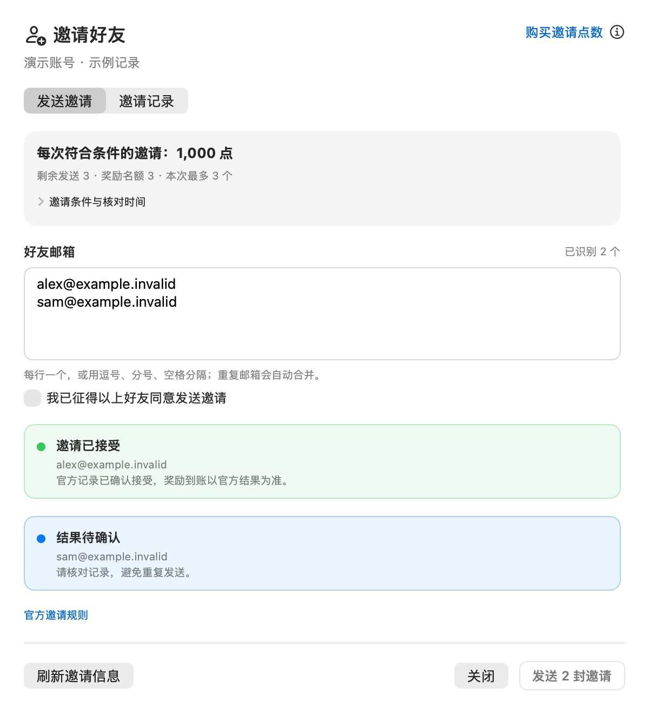
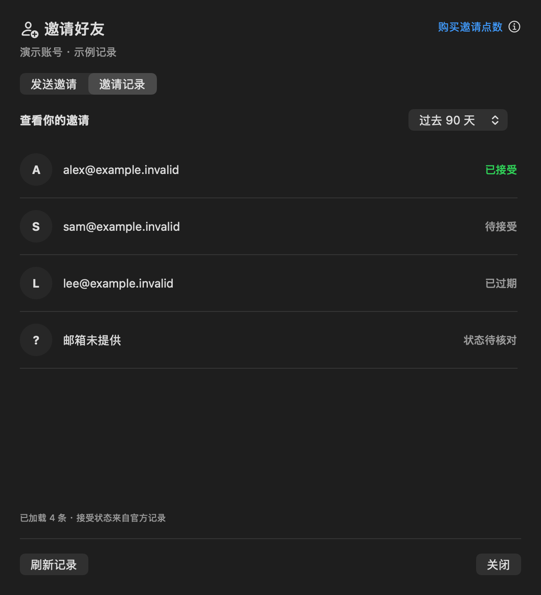
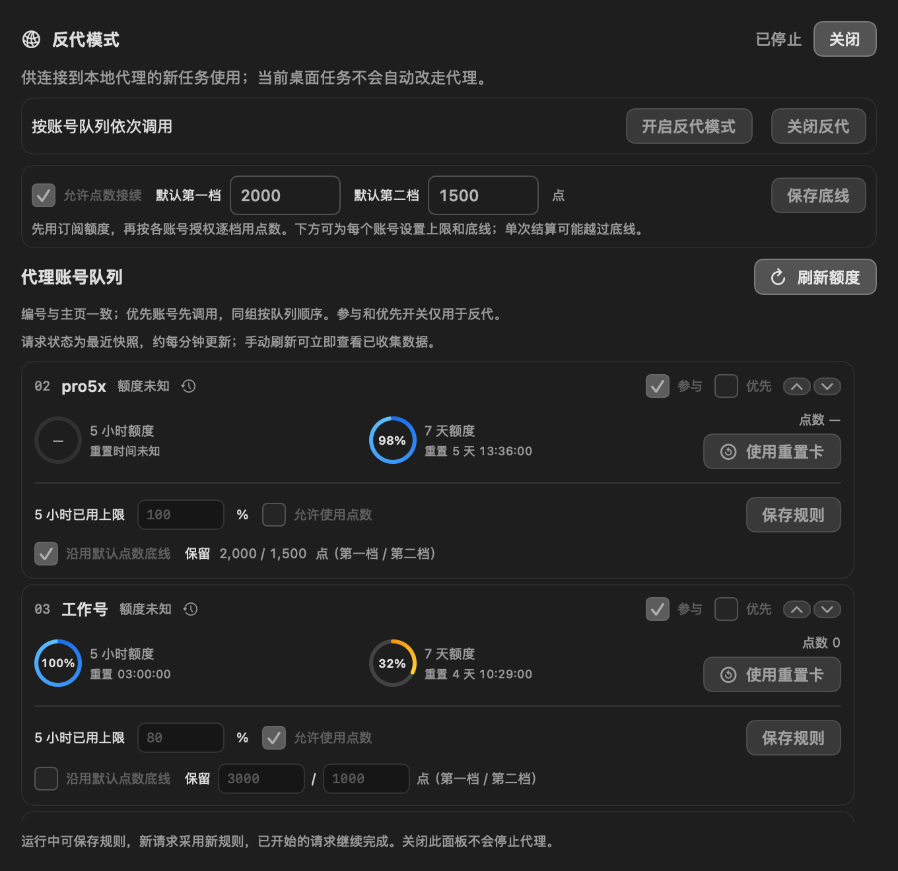
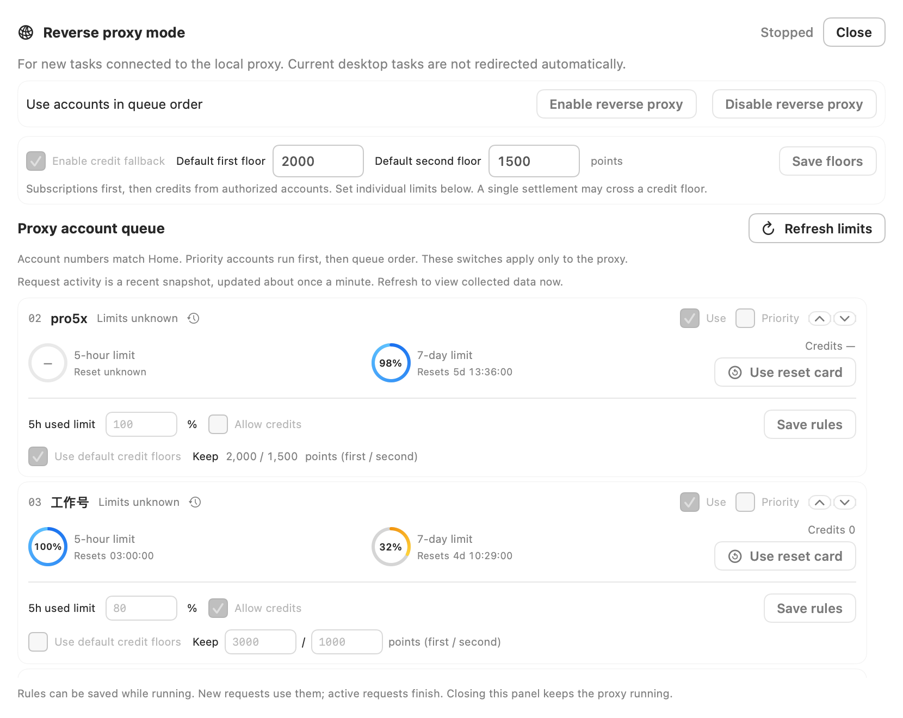
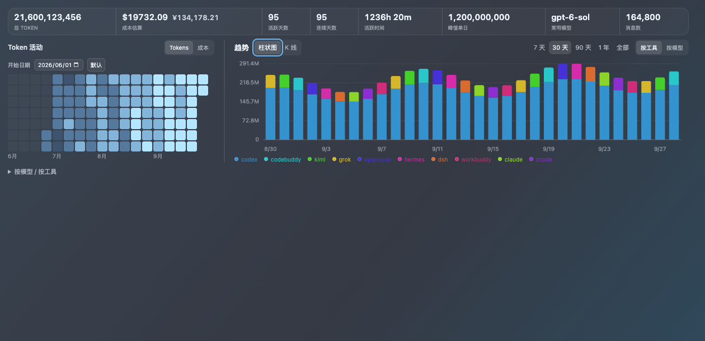
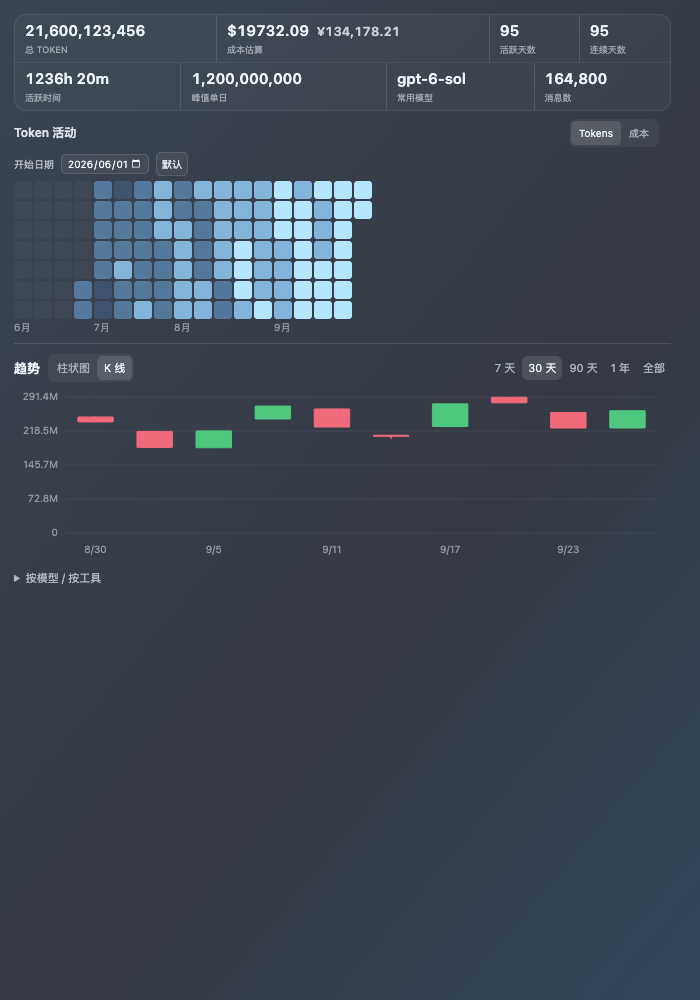

# AiGoodBro · 1003v1 previews

Synthetic source previews; no live accounts or delivery results. The four native panels below come from the candidate's SwiftUI components. The overview uses the bundled dashboard in isolated Chromium. Image dimensions and SHA-256 values are recorded in `manifest.json`.

## Batch invitations and official history

Sent, rejected and unconfirmed states are separate. Accepted history does not prove a credited reward.

## Per-account proxy rules

Rules are editable while running. These stopped, synthetic panels demonstrate the layout only.

## Cost and column widths

The CNY factor is fixed at USD × 6.8, not a live exchange rate. Columns use the displayed content's measured width; saved manual widths take precedence.

[Validation and remaining limits](../../source-publication-1003v1.md) · [Earlier complete gallery and nine themes](../1002v2/README.md)
